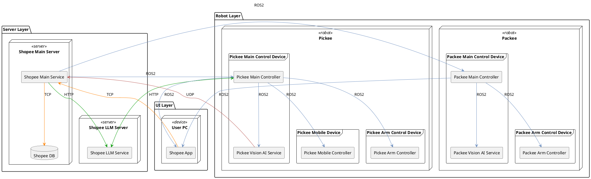

```plantuml
@startuml Software Architecture

skinparam backgroundColor #FFFFFF
skinparam componentStyle rectangle

' UI Layer
package "UI Layer" {
    node "User PC" <<device>> {
        component [Shopee App] as ShopeeApp
    }
}

' Server Layer
package "Server Layer" {
    node "Shopee Main Server" <<server>> {
        component [Shopee Main Service] as MainService
        database "Shopee DB" as DB
    }
    
    node "Shopee LLM Server" <<server>> {
        component [Shopee LLM Service] as LLMService
    }
}

' Robot Layer - Pickee
package "Robot Layer" {
    node "Pickee" <<robot>> {
        frame "Pickee Main Control Device" {
            component [Pickee Main Controller] as PickeeMainCtrl
            component [Pickee Vision AI Service] as PickeeVision
        }
        
        frame "Pickee Mobile Device" {
            component [Pickee Mobile Controller] as PickeeMobile
        }
        
        frame "Pickee Arm Control Device" {
            component [Pickee Arm Controller] as PickeeArm
        }
    }
    
    ' Robot Layer - Packee
    node "Packee" <<robot>> {
        frame "Packee Main Control Device" {
            component [Packee Main Controller] as PackeeMainCtrl
            component [Packee Vision AI Service] as PackeeVision
        }
        
        frame "Packee Arm Control Device" {
            component [Packee Arm Controller] as PackeeArm
        }
    }
}

' Connections
ShopeeApp -[#FF8000]-> MainService : TCP
MainService -[#FF8000]-> DB : TCP
MainService -[#009900]-> LLMService : HTTP
MainService -[#6c8ebf]-> PickeeMainCtrl : ROS2
MainService -[#6c8ebf]-> PackeeMainCtrl : ROS2
PickeeMainCtrl <-[#009900]-> LLMService : HTTP
PickeeVision -[#b85450]-> MainService : UDP
PickeeMainCtrl -[#6c8ebf]-> ShopeeApp : ROS2
PackeeMainCtrl -[#6c8ebf]-> ShopeeApp : ROS2

' Pickee Internal Connections
PickeeMainCtrl -[#6c8ebf]-> PickeeVision : ROS2
PickeeMainCtrl -[#6c8ebf]-> PickeeMobile : ROS2
PickeeMainCtrl -[#6c8ebf]-> PickeeArm : ROS2

' Packee Internal Connections
PackeeMainCtrl -[#6c8ebf]-> PackeeVision : ROS2
PackeeMainCtrl -[#6c8ebf]-> PackeeArm : ROS2

@enduml
```
