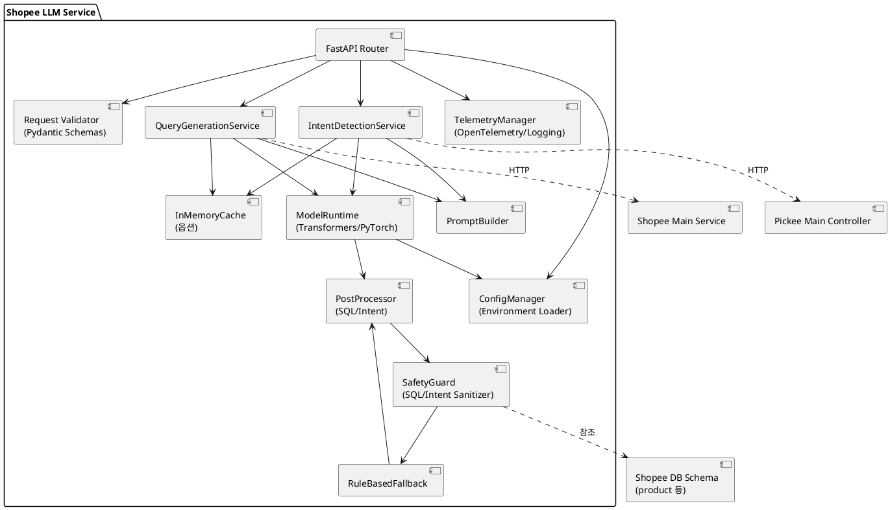

# Shopee LLM Service 세부 설계

본 문서는 Shopee 로봇 쇼핑 시스템에서 LLM Service가 수행해야 할 기능, 내부 구성, 예외 처리, 운영 전략을 상세히 정의합니다.

---

## 1. 요구사항 연계

| 요구사항 ID | 출처 | 설명 | LLM Service 대응 요소 |
| --- | --- | --- | --- |
| UR_02 / SR_04 | 상품 탐색 | 자연어 기반 상품 검색 | `/llm_service/search_query`, `QueryGenerationService` |
| UR_06 / SR_14 | 재고 보충 보조 | 직원 음성 명령 해석 | `/llm_service/intent_detection`, `IntentDetectionService` |

## 2. 내부 아키텍처

LLM Service는 FastAPI 기반의 레이어드 아키텍처를 따르며, 추론 파이프라인과 규칙 기반 보조 로직을 결합하여 안정적인 응답을 제공합니다.

---

## 3. 모듈 설계

### 3.1 애플리케이션 초기화 (`app/main.py`)
- `create_app()` 함수가 FastAPI 인스턴스를 생성하고 라우터, 미들웨어, 예외 핸들러를 등록.
- 서버 기동 시 `ModelManager.load()`를 호출하여 모델/토크나이저를 로드하고, 실패 시 503 응답을 반환하도록 `Lifespan` 컨텍스트에서 관리.
- 의존성 주입(Dependency Injection)으로 `QueryGenerationService`, `IntentDetectionService`를 공급.

### 3.2 스키마 정의 (`app/schemas.py`)
- `SearchQueryRequest`, `SearchQueryResponse`, `IntentDetectionRequest`, `IntentDetectionResponse` Pydantic 모델을 정의.
- 공통 필드: `text: constr(strip_whitespace=True, min_length=1, max_length=512)`.
- `IntentDetectionResponse.entities`는 `Dict[str, Union[str, int, float]]` 형태로 선언하고, 주요 키(`product_name`, `quantity`, `destination_section`)에 대한 선택적 검증 로직을 후처리에서 수행.

### 3.3 컨트롤러 계층 (`app/api.py`)
- 엔드포인트: 
  - `POST /llm_service/search_query`: `SearchQueryRequest` 검증 후 서비스 호출, 200/400/503 응답 관리.
  - `POST /llm_service/intent_detection`: `IntentDetectionRequest` 검증 후 서비스 호출, 200/400/503 응답 관리.
- 공통 예외 처리:
  - `ValidationError` → 400.
  - `ModelNotReadyError` → 503.
  - `InferenceTimeoutError` → 503.
  - `UnsafeOutputError` → 422 (Main Service 설계의 규칙 기반 fallback을 유도).

### 3.4 서비스 계층

#### 3.4.1 `QueryGenerationService`
- 책임: 자연어 검색어를 SQL 쿼리로 변환하여 `Main Service`가 데이터베이스 조회에 활용할 수 있도록 지원.
- 절차:
  1. 인식된 음성을 텍스트로 정규화
  2. LLM 추론 수행
  4. LLM이 결과를 파싱하고 화이트리스트 컬럼(`product_id`, `barcode`, `name`, `quantity`, `price`, `discount_rate`, `category`, `allergy_info_id`, `is_vegan_friendly`, `section_id`, `warehouse_id`)만 허용.
  5. `SafetyGuard`가 DML, 조인, 서브쿼리 사용 여부를 정규표현식 기반 및 AST 파서로 검사.
  6. 검증 실패 또는 모델 오류 발생 시 `RuleBasedFallback`이 키워드 매칭 기반 SQL(`SELECT ... WHERE name LIKE '%키워드%'`)을 생성.
- 비동기 인터페이스(`async def generate_sql(text: str) -> SearchQueryResponse`).
- 최대 두 번 재시도(LLM 오류 시), 재시도 간 지수 백오프(50ms, 100ms).

#### 3.4.2 `IntentDetectionService`
- 책임: 음성 명령 텍스트에서 의도, 개체(상품명, 수량, 목적지 등)를 추출하여 Pickee Main Controller가 상태 전환을 수행하도록 지원.
- 절차:
  1. `PromptBuilder`가 시퀀스 다이어그램(`SC_06_1`, `SC_06_3`, `SC_06_5`)에 정의된 명령 패턴을 포함한 few-shot 프롬프트를 생성.
  2. `ModelRuntime.generate()`로 JSON 형태 응답을 생성(temperature 0.3, top_p 0.8).
  3. `IntentPostProcessor`가 JSON 파싱, 키 보정, 수량 정수화, 목적지 정상화(`/main/get_warehouse_pose` 연동을 위한 `warehouse_id` 후보 포함).
  4. `SafetyGuard`가 의도 화이트리스트(`fetch_product`, `transport_product`, `stop_following`, `resume_following`, `confirm`, `reject`)를 적용하고, 미확인 의도 시 `fallback_intent = 'unknown'`으로 반환.
  5. `RuleBasedFallback`이 가중치 기반 키워드 분류기를 통해 최소한의 의도 식별 제공.
- 응답 지연 상한: 600ms (P95). 400ms 초과 시 경고 로그 남김.

### 3.5 모델 관리 (`app/model_manager.py`)
- `ModelManager` 싱글톤이 모델/토크나이저를 로드.
- 지원 모델:
  - 기본: `llama 3.1` 지향 (추론 서버 외부 의존 가능).

### 3.6 규칙 기반 보조 로직 (`app/rules.py`)
- `RuleBasedFallback.generate_sql(text)`:
  - 토큰화 후 상품명 후보를 동일/부분 매칭.
  - `LIKE` 기반 템플릿 SQL 생성.
  - 카테고리, 비건/알레르기 규칙 인식(예: '알러지 없는', '비건').
- `RuleBasedFallback.detect_intent(text)`:
  - 명령 패턴(정규표현식 + `rapidfuzz`)으로 의도/개체 추출.
  - 신뢰도 점수를 함께 반환하여 상위 레이어에서 판단.
---

## 4. 데이터 처리 흐름

### 4.1 상품 검색 쿼리 생성 흐름
1. Main Service가 `POST /llm_service/search_query` 호출(`SC_01_2` 기준).
2. FastAPI가 요청을 검증하고 `QueryGenerationService` 호출.
3. LLM 추론 결과가 SQL 검증을 통과하면 응답, 실패 시 규칙 기반 Fallback 적용.
4. 최종 SQL을 `SearchQueryResponse.sql_query`로 반환.
5. Telemetry가 요청 ID, 지연 시간, 가드 결과를 기록.

### 4.2 발화 의도 분석 흐름
1. Pickee Main Controller가 `POST /llm_service/intent_detection` 호출(`SC_06_1`, `SC_06_3`, `SC_06_5`).
2. `IntentDetectionService`가 텍스트를 정규화 후 프롬프트 생성.
3. LLM 추론 → 후처리 → 의도/개체 검증, 미해결 시 Fallback.
4. 응답 페이로드는 `intent`, `entities` 키를 포함하며, 불확실 시 `confidence` 필드(0.0~1.0)를 추가.
5. Telemetry가 의도 분포, 실패 코드, Fallback 여부를 기록.

---

## 5. 예외 처리 및 복구 전략

- 입력 검증 실패: 400 + 에러 상세 메시지(JSON).
- 모델 미로드: 503 + `{'detail': 'model_not_ready'}`.
- 추론 타임아웃(설정값 기본 2초): 503, Fallback 결과 동봉.
- 안전성 점검 실패(SQL 인젝션 패턴, 허용되지 않은 의도): 422, `fallback_used: true`.
- 내부 오류: 500, Sentry 등 APM 연동으로 알림.
- 모든 오류 응답에는 `request_id`, `timestamp`, `client_type` 메타데이터 삽입.

---

## 6. 비기능 요구사항 대응

- **성능**: Docker 컨테이너 기준 추론 P95 600ms 달성 목표. `asyncio` 기반 비동기 처리, GPU 사용 시 배치 추론(최대 배치 4) 지원.
- **가용성**: 모델 재로딩을 위해 `/internal/reload` 관리자 엔드포인트(인증 필요) 제공. 헬스체크 `/healthz`는 모델 로딩 여부를 반영.
- **보안**: 현재 문서 범위는 인증 미포함(Interface Specification 참고). 향후 API Gateway 적용 시 JWT 헤더 검증 추가 예정.
- **확장성**: 모델 서버 분리 시 `ModelRuntime`을 gRPC 호출자로 교체할 수 있도록 인터페이스 추상화.
- **유지보수성**: 모듈/클래스/함수 명명 규칙은 `CodingStandard/standard.md`를 준수(snake_case, PascalCase 등).

---

## 7. 배포 및 운영

- 컨테이너 이미지에 Python 3.11, FastAPI, `transformers`, `torch` 포함.
- Gunicorn+Uvicorn 조합으로 WSGI 실행(`--workers`는 CPU 코어 수 기반).
- 환경 변수 관리: `configmap`(K8s) 또는 `.env`.
- 모델 파일은 로컬 마운트 또는 Hugging Face 캐시를 사용, 기동 시 무결성 해시 검사.
- 장애 대응:
  - 모델 재초기화 실패 시 Alertmanager 통보.
  - 연속 실패율 5% 초과 시 규칙 기반 모드로 강제 전환(Feature Flag).

---

## 8. 테스트 전략

- **단위 테스트**: `pytest` 활용, 주요 컴포넌트(Preprocessor, PromptBuilder, PostProcessor, SafetyGuard, Fallback) 별 테스트.
- **통합 테스트**: 샘플 입력·출력(`Main_vs_LLM.md` 예제 기반)으로 FastAPI `TestClient` 실행.
- **회귀 테스트**: 실제 상품/음성 명령 데이터셋 50문장을 골든셋으로 유지.
- **성능 테스트**: Locust/Vegetta로 RPS 20 수준 부하 테스트, P95 측정.
- **안전성 테스트**: SQL 인젝션, 금칙어, 비정상 의도 시나리오 검증.

---

## 9. 향후 확장 고려 사항

- 도메인 데이터로 파인튜닝(LORA) 및 지식 기반 검색(RAG) 도입.
- Main Service 이벤트 스트림 연동을 통한 지속 학습 피드백 루프 구축.
- Pickee 현장 명령 로그를 활용한 의도 사전 확장 및 다국어 지원.
- 모델 성능 자동 모니터링(MAE, Intent F1) 대시보드 추가.

---
