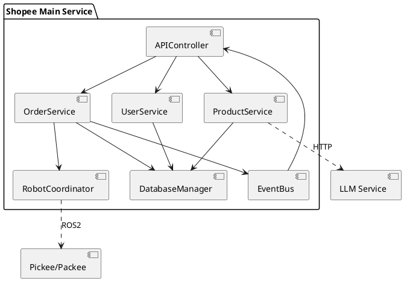
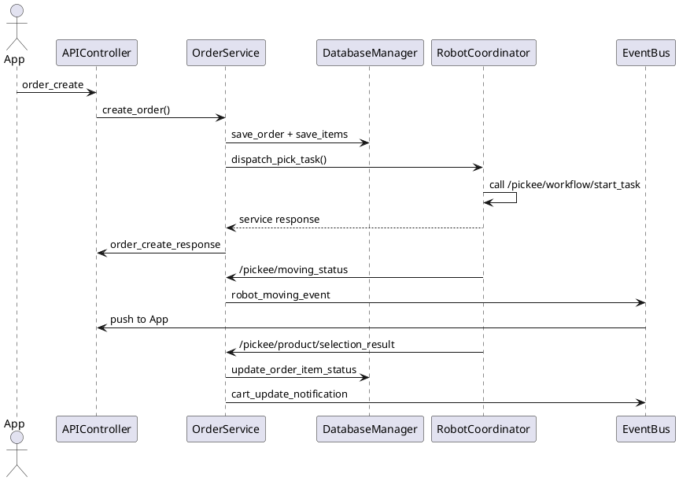

# Shopee Main Service 세부 설계

본 문서는 Shopee Main Service의 내부 구조, 주요 워크플로우, 외부 연동, 데이터 처리 방식을 상세히 정의합니다.

---

## 1. 전체 아키텍처

Main Service는 역할별 모듈로 분리하여 단일 책임 원칙을 지키고, 테스트/유지보수 용이성을 확보합니다.

---

## 2. 주요 클래스 및 책임

### 2.1. `APIController`
- **책임**: Shopee App과의 TCP 통신 진입점.
- **기능**:
  - 비동기 TCP 서버를 구성하고 연결을 관리.
  - 수신 메시지(JSON)를 파싱하여 핸들러에 라우팅.
  - 서비스 결과를 응답 포맷에 맞춰 전송.
  - `EventBus`로부터 비동기 알림을 받아 App에 push.

### 2.2. `UserService`
- **책임**: 사용자 인증 및 정보 관리.
- **기능**:
  - `login(user_id, password_hash)` 비밀번호 검증(Bcrypt).
  - `get_user_info` 관리용 조회.

### 2.3. `ProductService`
- **책임**: 상품 검색 및 재고 관리.
- **기능**:
  - `search_products(query)`는 LLM `/search-query` 호출 후 DB 조회.
  - 재고 CRUD (`inventory_search/create/update/delete`).
  - LLM 실패 시 규칙 기반 fallback SQL 생성.

### 2.4. `OrderService`
- **책임**: 주문 라이프사이클 총괄.
- **기능**:
  - `create_order(user_id, items)` 주문/아이템 저장 및 로봇 예약.
  - `handle_moving_status`, `handle_arrival_notice`, `handle_cart_handover`, `handle_packee_complete` 등 이벤트 기반 상태 전환.
  - `handle_robot_failure(event_data)` 장애 감지 시 재할당·롤백.
  - 사용자 알림, 재고 예약/복구, 주문 히스토리 기록을 비동기적으로 조율.

### 2.5. `RobotCoordinator`
- **책임**: Pickee/Packee와의 ROS2 통신 추상화.
- **기능**:
  - `/pickee/workflow/start_task`, `/packee/packing/start` 등 서비스 호출 래핑.
  - `/pickee/arrival_notice`, `/packee/packing_complete` 등 토픽 구독.
  - 로봇 상태 캐시 및 사용 가능 로봇 선택.

### 2.6. `DatabaseManager`
- **책임**: ORM 기반 데이터 접근.
- **기능**:
  - SQLAlchemy 세션 팩토리 제공 (`session_scope` 컨텍스트).
  - 세션 수명·커밋/롤백을 일관되게 관리하며, 구체적인 CRUD 로직은 각 서비스(`OrderService`, `InventoryService`, `RobotHistoryService` 등)가 담당.

### 2.7. `EventBus`
- **책임**: 내부 비동기 이벤트 중계.
- **기능**:
  - 주문/로봇 상태 이벤트 큐 관리.
  - 구독자(`APIController`, 관리자 모듈)에 이벤트 푸시.

---

## 3. 요구사항 추적 매트릭스

| 요구사항 ID | 설명 | 담당 모듈/메서드 | 관련 문서 |
| --- | --- | --- | --- |
| UR_01 / SR_01 | 로그인 | `APIController.handle_user_login`, `UserService.login` | App_vs_Main.md |
| UR_02 / SR_04 | 상품 검색 | `handle_product_search`, `ProductService.search_products` | App_vs_Main.md, Main_vs_LLM.md |
| UR_03 / SR_07~SR_09 | 원격 쇼핑 주문/피킹 | `OrderService.create_order`, `OrderService.handle_* 이벤트`, `RobotCoordinator.dispatch_pick_task` | SequenceDiagram/SC_01_3.md, SC_02_x |
| UR_04 / SR_10~SR_12 | 모니터링/알림 | `EventBus.publish`, `OrderService._push_to_user`, `APIController.push_event` | App_vs_Main.md (이벤트) |
| UR_05 / SR_13 | 포장 보조 | `RobotCoordinator.dispatch_pack_task`, `OrderService.handle_packee_complete` | SequenceDiagram/SC_03_x |
| UR_07~UR_10 | 주문/작업/로봇/상품 관리 | `OrderService` 조회 API, `RobotStateStore.list_states`, `ProductService.inventory_*` | App_vs_Main.md |
| UR_11~UR_13 | 복귀·충전·주행 이벤트 수신 | `RobotCoordinator` 토픽 콜백(`_on_pickee_status`, `_on_pickee_move`, 등) | Main_vs_Pic_Main.md |

추적되지 않은 요구는 백로그에 등록하여 설계 보완 시 반영합니다.

---

## 4. 모듈 상호작용

### 4.1 APIController 파이프라인
1. 소켓 수락 → 연결별 Reader/Writer 생성.
2. JSON 파싱 → 스키마 검증 → 라우팅 테이블에서 핸들러 호출.
3. 응답 전송: 메시지 구조(`type/result/error_code/data/message`)에 `correlation_id`·`timestamp`를 자동 부여해 추적성을 확보.
4. 비동기 이벤트: `EventBus` 구독 → 전송 실패 시 최대 3회 지수 백오프 재시도 후 세션을 정리.
   - 재시도 파라미터는 `ROS_SERVICE_RETRY_ATTEMPTS`, `ROS_SERVICE_RETRY_BASE_DELAY` 설정으로 조정.

### 4.2 OrderService ↔ RobotCoordinator
- 주문 상태 머신
  - `PAID` → `MOVING` → `PICKING` → `MOVING_TO_PACK` → `PACKING` → `PACKED`.
  - 실패 시 `FAIL_PICKUP`, `FAIL_PACK` 등으로 전환.
- RobotCoordinator는 ROS 메시지를 Domain Event로 변환 후 `OrderService`에 전달.
- Pickee 작업 완료 후 Packee 작업 자동 트리거.

### 4.3 ProductService ↔ LLM
- REST 호출 타임아웃 1.5s, 설정 기반 재시도(`LLM_MAX_RETRIES`, `LLM_RETRY_BACKOFF`).
- LLM이 반환한 WHERE 절은 허용된 컬럼·연산만 포함하는지 화이트리스트 검증 후 실행하며, 미통과 시 기본 LIKE 검색으로 대체.
- 모든 실패 경로에서는 키워드 매칭 기반 `LIKE` 쿼리 빌더로 fallback.

### 4.4 DatabaseManager
- `session_scope()` 컨텍스트 매니저: 예외 발생 시 rollback, 종료 시 commit.
- 긴 트랜잭션 방지를 위해 단계별 커밋(예: 주문 생성 후 즉시 커밋).

---

## 5. 핵심 워크플로우

### 5.1 로그인
1. App → Main: `user_login`.
2. `UserService.login`이 계정 존재 여부 및 비밀번호 해시 확인.
3. 성공 시 사용자 정보 반환, 실패 시 `AUTH_001/002`.

### 5.2 상품 검색
1. App → Main: `product_search`.
2. `ProductService.search_products`가 LLM `/search-query` 호출.
3. SQL 실행, 결과 목록 및 합계 반환.
4. LLM 실패 시 fallback SQL, 여전히 실패 시 `SYS_001`.

### 5.3 주문 생성 및 Pickee 흐름

- Pickee 실패 시: `FAIL_PICKUP`, 관리자 알림, 재시도 여부 결정.

### 5.4 Packee 포장
1. Pickee 장바구니 전달 완료 수신.
2. `RobotCoordinator.dispatch_pack_task`로 Packee 작업 시작.
3. Packee 완료 시 `PACKED`, App/DB 업데이트.
4. 실패 시 `FAIL_PACK`으로 전환, 관리자 개입 기록.

### 5.5 관리자 모니터링
- `/pickee/robot_status`, `/packee/robot_status` 토픽 데이터를 캐시.
- App 요청 시 최신 스냅샷을 반환, 필요 시 실시간 이벤트 푸시.
- 관리자 전용 API는 권한 체크 후 응답.

---

## 6. 인터페이스 맵핑

### 6.1 App ↔ Main (TCP)
| 요청 | Handler | 응답/이벤트 | 주요 로직 |
| --- | --- | --- | --- |
| `user_login` | `handle_user_login` | `user_login_response` | `UserService.login` |
| `product_search` | `handle_product_search` | `product_search_response` | LLM + DB |
| `order_create` | `handle_order_create` | `order_create_response` | 주문/로봇 할당 |
| `product_selection` | `handle_product_selection` | `product_selection_response`, `cart_update_notification` | Pickee Arm 연동 |
| `shopping_end` | `handle_shopping_end` | `shopping_end_response` | 상태 `PICKING` → `MOVING_TO_PACK` |
| `inventory_*` | 전용 핸들러 | *_response | `ProductService` |
| `robot_history_search` | 전용 핸들러 | `robot_history_search_response` | DB 조회 |
| 이벤트 | `push_event` | `robot_moving_notification`, `robot_arrived_notification`, `packing_info_notification`, ... | `EventBus` |

### 6.2 Main ↔ LLM
- `/llm/search_query`: GET `text` → `{ sql_query }`
- `/llm/bbox`: GET `text` → `{ bbox }`
- `/llm/intent_detection`: GET `text` → `{ intent, entities }`
- 401/500 응답 시 fallback 사용, 로그 기록.

### 6.3 ROS 인터페이스

| 구분 | 이름 | 방향 | 설명 | Msg |
| --- | --- | --- | --- | --- |
| Service | `/pickee/workflow/start_task` | Main → Pickee | 피킹 시작 | `shopee_interfaces/srv/PickeeWorkflowStartTask` |
| Service | `/pickee/product/process_selection` | Main → Pickee | 상품 담기 명령 | `shopee_interfaces/srv/PickeeProductProcessSelection` |
| Topic | `/pickee/moving_status` | Pickee → Main | 이동 상태 | `shopee_interfaces/msg/PickeeMoveStatus` |
| Topic | `/pickee/product/selection_result` | Pickee → Main | 담기 결과 | `shopee_interfaces/msg/PickeeProductSelection` |
| Topic | `/pickee/robot_status` | Pickee → Main | 로봇 상태 | `shopee_interfaces/msg/PickeeRobotStatus` |
| Service | `/packee/packing/check_availability` | Main ↔ Packee | 포장 가능 여부 | `shopee_interfaces/srv/PackeePackingCheckAvailability` |
| Service | `/packee/packing/start` | Main → Packee | 포장 시작 | `shopee_interfaces/srv/PackeePackingStart` |
| Topic | `/packee/availability_result` | Packee → Main | 포장 가능 여부 확인 결과 | `shopee_interfaces/msg/PackeeAvailability.msg` |
| Topic | `/packee/packing_complete` | Packee → Main | 포장 완료 | `shopee_interfaces/msg/PackeePackingComplete` |
| Topic | `/packee/robot_status` | Packee → Main | 로봇 상태 | `shopee_interfaces/msg/PackeeRobotStatus` |

ROS 메시지는 InterfaceSpecification 문서 기반 DTO로 역직렬화하여 내부 도메인 이벤트로 변환합니다.

---

## 7. 데이터 및 트랜잭션 전략

- **ORM 매핑**:
  - `OrderModel` ↔ `order`
  - `OrderItemModel` ↔ `order_item`
  - `ProductModel` ↔ `product`
  - `RobotHistoryModel` ↔ `robot_history`
- **트랜잭션 경계**:
  - 주문 생성/아이템 삽입은 단일 세션 안에서 수행되며, 로봇 예약 결과는 실패 시 롤백·재고 복구로 일관성 유지.
  - 주문 상태 업데이트는 세션 컨텍스트 내에서 수행되고, 재고 변경은 `InventoryService.check_and_reserve_stock()`/`release_stock()`가 `SELECT ... FOR UPDATE`로 잠금을 적용.
  - 히스토리 기록은 전용 테이블에 Append 방식으로 저장.
- **동시성 제어**:
  - 로봇 할당은 `RobotStateStore` + `InMemoryRobotStateBackend`의 `asyncio.Lock`과 `try_reserve()`를 사용해 원자성을 보장.
  - TCP 처리 스레드와 ROS 콜백이 동시에 DB에 접근하므로 세션은 스레드 로컬이 아닌 컨텍스트 기반으로 관리.

---

## 8. 오류 처리 및 복구

- 입력 검증 실패: `result=false`, `error_code` 설정, 상세 메시지 로그 저장.
- LLM 호출 실패: 즉시 로그 후 기본 LIKE 검색으로 fallback, 모든 경로가 실패하면 오류 이벤트 발행.
- ROS 서비스 실패: 단일 호출에서 예외가 발생하면 해당 주문 흐름에서 장애 처리·예약 해제·사용자 알림을 수행.
- ROS 토픽 타임아웃: `RobotHealthMonitor`가 `ROS_STATUS_HEALTH_TIMEOUT` 기준으로 상태 토픽 미수신 로봇을 감지하여 `mark_offline` 및 장애 이벤트를 트리거.
- TCP 연결 해제: 전송 실패 시 최대 3회 재시도 후 연결을 정리한다.

---

## 9. 비기능 요구 사항

- **성능**: 동시 세션 200, 주문 생성 지연 2초 이하, ROS 명령 RTT 500ms 이하 목표.
- **가용성**: 로봇/LLM 장애 시 재시도·fallback·사용자 알림으로 대응한다.
- **보안**: 비밀번호 해시, 관리자 API 권한 검사 중심으로 운영한다.
- **감시**: 기본 로그 기반으로 사건을 추적합니다.
- **테스트**: 단위 테스트 + ROS 인터페이스 Mock 통합 테스트 + 시나리오 별 E2E 테스트.

---

## 10. 운영 및 배포

- 설정 관리: `.env` → FastAPI settings, ROS 네임스페이스, LLM 엔드포인트.
- 배포: Docker 이미지 빌드 → CI Pytest → 스테이징 ROS 환경 검증 → 프로덕션 배포.
- 롤백: DB 마이그레이션 버전 관리, 주문/상태 스냅샷 백업.

---

## 11. 미해결 항목

- 관리자 대시보드용 추가 통계 API 정의.
- 로봇 장애 자동 재시작 시나리오 상세화.
- LLM 파인튜닝 데이터 파이프라인 설계.

후속 설계 회의에서 우선순위를 정하고 문서를 업데이트합니다.
