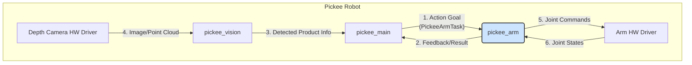
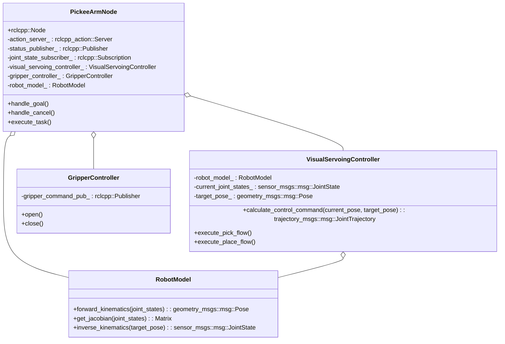
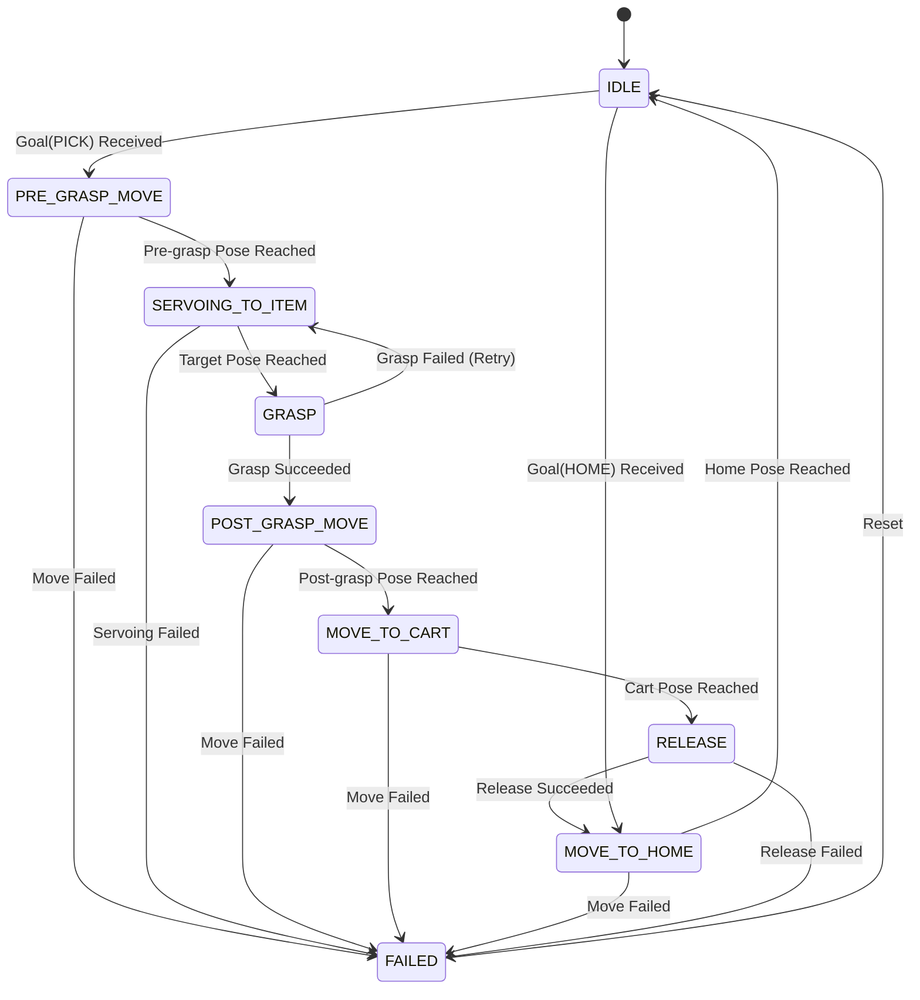

# Pickee Arm 상세 설계

## 1. 개요

이 문서는 `pickee_arm` ROS2 패키지의 상세 설계를 다룹니다. `pickee_arm`은 Pickee 로봇의 팔을 제어하여, `pickee_main`의 지시에 따라 선반의 상품을 집어(Pick) 카트에 놓는(Place) 임무를 수행합니다.

핵심 설계 사상은 **MoveIt2를 사용하지 않고**, 뎁스 카메라를 이용한 **위치 기반 비주얼 서보잉(Position-Based Visual Servoing, PBVS)**을 통해 실시간으로 정밀한 제어를 구현하는 것입니다.

## 2. 시스템 아키텍처

`pickee_arm`은 `pickee_main`으로부터 작업을 지시받고, `pickee_vision`이 제공하는 시각 정보를 (`pickee_main`을 통해) 활용하며, 실제 로봇 팔 하드웨어 드라이버와 통신합니다.

**데이터 흐름:**

1.  `pickee_main`이 `pickee_arm`에게 `PickeeArmTask` Action Goal을 전송합니다. (e.g., "ID 123 상품을 집어라")
2.  `pickee_arm`은 작업 수행 중 주기적으로 Feedback(현재 상태)을, 완료 후 Result(성공/실패)를 `pickee_main`에 전송합니다.
3.  `pickee_vision`은 상품 인식 결과를 `pickee_main`에 전달합니다.
4.  `pickee_main`은 이 정보를 가공하여 Action Goal에 담아 `pickee_arm`에 전달합니다.
5.  `pickee_arm`은 제어 명령(관절 속도/위치)을 계산하여 `Arm HW Driver`에 전송합니다.
6.  `Arm HW Driver`로부터 현재 로봇의 관절 상태를 받아 제어에 반영합니다.

## 3. 클래스 다이어그램

`pickee_arm` 노드는 역할에 따라 여러 클래스로 분리하여 설계합니다.

-   **`PickeeArmNode`**: ROS2 통신을 총괄하는 메인 클래스. Action 서버, Publisher/Subscriber를 관리하고, 작업 요청에 따라 다른 컨트롤러 클래스를 호출합니다.
-   **`VisualServoingController`**: 비주얼 서보잉 제어 로직을 담당. 목표 자세와 현재 자세 간의 오차를 기반으로 로봇 팔의 관절 속도 명령을 계산합니다.
-   **`GripperController`**: 그리퍼의 열기/닫기 등 하드웨어와 관련된 단순 명령을 추상화합니다.
-   **`RobotModel`**: 로봇의 기구학적 모델. 정기구학(FK), 역기구학(IK), 자코비안(Jacobian) 계산을 담당합니다. MoveIt2를 사용하지 않으므로 이 클래스의 정확한 구현이 매우 중요합니다.

## 4. Pickee Arm 내부 상태 머신

`PickeeArmTask` Action을 수행하는 동안 `pickee_arm`은 다음과 같은 내부 상태를 가집니다.

## 5. 주요 기능 상세 설계

### 5.1. 비주얼 서보잉 (Visual Servoing) 로직

위치 기반 비주얼 서보잉(PBVS)을 채택하며, 제어 루프는 다음과 같습니다.

1.  **목표 설정**: `pickee_main`으로부터 받은 목표 상품의 3D 좌표(`P_target`)를 설정합니다.
2.  **현재 상태 획득**:
    -   로봇 드라이버로부터 현재 관절 각도(`q_current`)를 수신합니다.
    -   `RobotModel::forward_kinematics`를 이용해 End-Effector의 현재 3D 좌표(`P_current`)를 계산합니다.
3.  **오차 계산**: 데카르트 공간(Cartesian Space)에서 위치 오차 `e = P_target - P_current`를 계산합니다.
4.  **제어 명령 생성**:
    -   오차에 제어 이득(Gain) `K`를 곱하여 End-Effector의 목표 속도 `v_desired = K * e`를 계산합니다.
    -   `RobotModel::get_jacobian`을 이용해 현재 관절 각도에서의 자코비안 행렬 `J`를 계산합니다.
    -   자코비안의 역행렬(또는 유사 역행렬)을 이용해 필요한 관절 속도 `q_dot_desired = J⁻¹ * v_desired`를 계산합니다.
5.  **명령 전송**: 계산된 관절 속도 `q_dot_desired`를 로봇 팔 드라이버에 전송합니다.
6.  **반복**: 오차 `e`가 허용 범위 내로 줄어들 때까지 2~5단계를 반복합니다.

### 5.2. 운동 흐름 (Motion Flow) - 'PICK' 작업 기준

1.  **`PRE_GRASP_MOVE`**: 목표 상품 위쪽의 안전한 중간 지점(Pre-grasp Pose)으로 이동합니다. 이 경로는 사전에 정의된 경로이거나 간단한 IK 계산을 통해 생성됩니다.
2.  **`SERVOING_TO_ITEM`**: 비주얼 서보잉 루프를 활성화하여 End-Effector를 목표 상품에 정밀하게 정렬시킵니다.
3.  **`GRASP`**: 서보잉 완료 후, End-Effector를 수직으로 하강시켜 상품을 파지할 위치로 이동하고 `GripperController::close()`를 호출합니다. 그리퍼 센서로 파지 성공 여부를 확인합니다.
4.  **`POST_GRASP_MOVE`**: 상품을 집은 후, 충돌을 피하기 위해 다시 안전한 중간 지점(Post-grasp Pose)으로 팔을 들어 올립니다.
5.  **`MOVE_TO_CART`**: 사전에 정의된 카트의 상품 적재 위치로 이동합니다.
6.  **`RELEASE`**: `GripperController::open()`을 호출하여 상품을 놓습니다.
7.  **`MOVE_TO_HOME`**: 다음 작업을 위해 기본 대기 자세(Home Pose)로 복귀합니다.

## 6. 예외 처리 방안

-   **목표 상품 인식 불가**: `pickee_main`이 유효한 목표 좌표를 주지 못할 경우, Action을 시작하지 않고 즉시 실패 처리합니다.
-   **기구학 해(IK Solution) 없음**: `RobotModel`이 특정 자세에 대한 IK 해를 찾지 못할 경우, Action을 중단하고 `IK_SOLUTION_NOT_FOUND` 에러와 함께 실패 처리합니다.
-   **자코비안 특이점 (Singularity)**: 제어 중 특이점 영역에 가까워지면 로봇이 불안정해질 수 있습니다. 자코비안 행렬의 조건수(Condition Number)를 모니터링하여 임계값 초과 시 안전하게 작업을 중단하고 `SINGULARITY_REACHED` 에러로 실패 처리합니다.
-   **관절 한계 도달**: 제어 명령이 로봇의 물리적 관절 한계를 초과하려 할 경우, 해당 명령을 제한하고 `JOINT_LIMIT_REACHED` 에러로 실패 처리합니다.
-   **파지 실패 (Grasp Failure)**: 그리퍼 센서가 상품을 제대로 잡지 못했다고 판단하면, 그리퍼를 열고 `SERVOING_TO_ITEM` 상태로 돌아가 파지를 재시도합니다. (최대 3회 시도 후 실패 처리)
