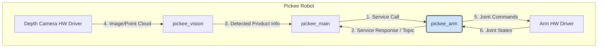
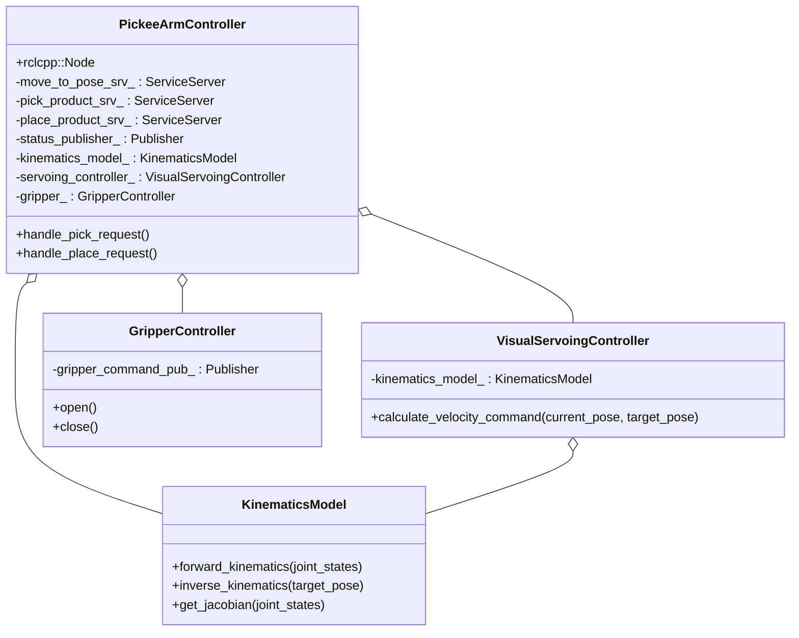
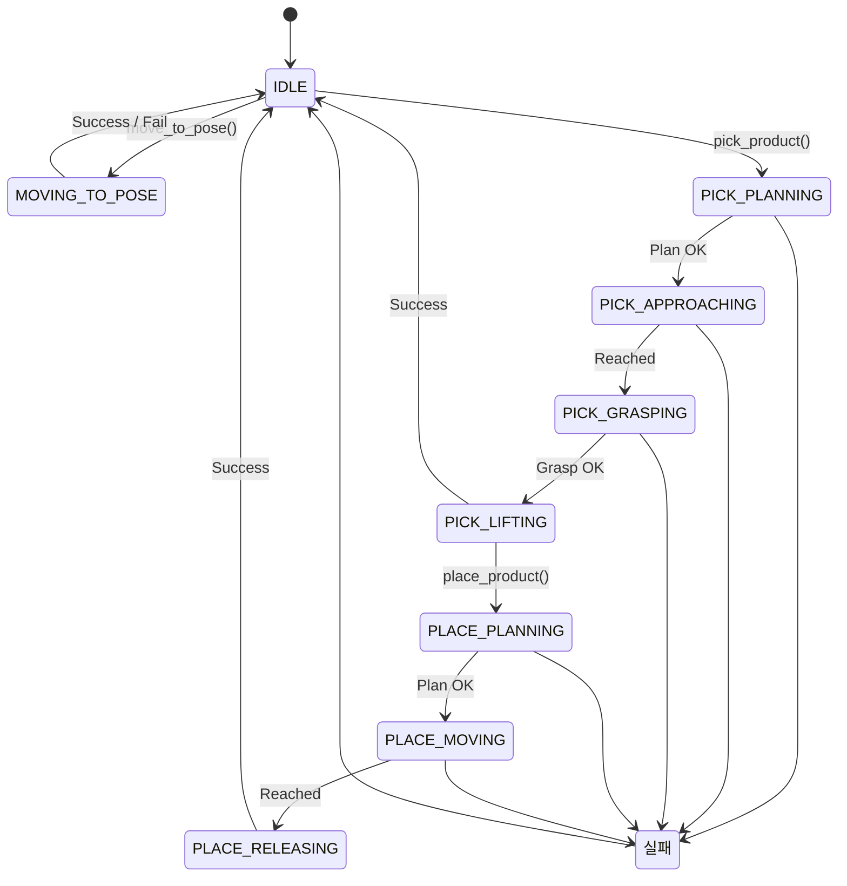

# Pickee Arm 상세 설계

## 1. 개요

이 문서는 `pickee_arm` ROS2 패키지의 상세 설계를 다룹니다. `pickee_arm`은 Pickee 로봇의 팔을 제어하여, `pickee_main`의 지시에 따라 선반의 상품을 집어(Pick) 카트에 담는(Place) 임무를 수행합니다.

핵심 설계 사상은 뎁스 카메라를 이용한 **위치 기반 비주얼 서보잉(Position-Based Visual Servoing, PBVS)**을 통해 실시간으로 정밀한 제어를 구현하는 것입니다.

## 2. 시스템 아키텍처

`pickee_arm`은 `pickee_main`으로부터 작업을 지시받고, `pickee_vision`이 제공하는 시각 정보를 (`pickee_main`을 통해) 활용하며, 실제 로봇 팔 하드웨어 드라이버와 통신합니다.

**데이터 흐름:**

1.  `pickee_main`이 `pickee_arm`에게 Service Call을 전송합니다. (e.g., "ID 123 상품을 집어라")
2.  `pickee_arm`은 작업 수행 중 주기적으로 Topic(현재 상태)을, 완료 후 Service Response(성공/실패)를 `pickee_main`에 전송합니다.
3.  `pickee_vision`은 상품 인식 결과를 `pickee_main`에 전달합니다.
4.  `pickee_main`은 이 정보를 가공하여 Service Call에 담아 `pickee_arm`에 전달합니다.
5.  `pickee_arm`은 제어 명령(관절 속도/위치)을 계산하여 `Arm HW Driver`에 전송합니다.
6.  `Arm HW Driver`로부터 현재 로봇의 관절 상태를 받아 제어에 반영합니다.

## 3. 클래스 다이어그램

`pickee_arm` 노드는 역할에 따라 여러 클래스로 분리하여 설계합니다. (Python 코딩 표준 기준)

-   **`PickeeArmController`**: ROS2 통신을 총괄하는 메인 노드 클래스. Service 서버, Publisher를 관리하고, 작업 요청에 따라 다른 컨트롤러 클래스를 호출합니다.
-   **`VisualServoingController`**: 비주얼 서보잉 제어 로직을 담당. 목표 자세와 현재 자세 간의 오차를 기반으로 로봇 팔의 관절 속도 명령을 계산합니다.
-   **`GripperController`**: 그리퍼의 열기/닫기 등 하드웨어와 관련된 단순 명령을 추상화합니다.
-   **`KinematicsModel`**: 로봇의 기구학적 모델. 정기구학(FK), 역기구학(IK), 자코비안(Jacobian) 계산을 담당합니다.

## 4. 개발 및 테스트 환경
- **언어**: C++ / Python
- **ROS 버전**: ROS2 Jazzy
- **주요 라이브러리**:
  - `OpenCV`: 이미지 처리 및 비주얼 서보잉 알고리즘 구현
  - `Arducam ToF SDK`: ToF 카메라 데이터 수신 및 처리를 위한 공식 라이브러리
  - `PCL (Point Cloud Library)`: ToF 카메라로부터 얻은 포인트 클라우드 데이터 처리
  - `rclcpp` / `rclpy`: ROS2 통신
- **실제 하드웨어**: Pickee 로봇 Arm, ToF(Time-of-Flight) 뎁스 카메라 (e.g., Arducam)

## 5. Pickee Arm 내부 상태 머신

`pickee_arm`은 `pick_product`, `place_product` 등의 서비스 요청을 처리하는 동안 다음과 같은 내부 상태를 가집니다.

## 6. 주요 기능 상세 설계

### 6.1. 비주얼 서보잉 (Visual Servoing) 로직

위치 기반 비주얼 서보잉(PBVS)을 채택하며, 제어 루프는 다음과 같습니다.

1.  **목표 설정**: `pickee_main`으로부터 받은 목표 상품의 3D 좌표(`P_target`)를 설정합니다.
2.  **현재 상태 획득**:
    -   로봇 드라이버로부터 현재 관절 각도(`q_current`)를 수신합니다.
    -   `KinematicsModel.forward_kinematics()`를 이용해 End-Effector의 현재 3D 좌표(`P_current`)를 계산합니다.
3.  **오차 계산**: 데카르트 공간(Cartesian Space)에서 위치 오차 `e = P_target - P_current`를 계산합니다.
4.  **제어 명령 생성**:
    -   `VisualServoingController.calculate_velocity_command()` 내부에서 오차에 제어 이득(Gain) `K`를 곱하여 End-Effector의 목표 속도 `v_desired = K * e`를 계산합니다.
    -   `KinematicsModel.get_jacobian()`을 이용해 현재 관절 각도에서의 자코비안 행렬 `J`를 계산합니다.
    -   자코비안의 역행렬(또는 유사 역행렬)을 이용해 필요한 관절 속도 `q_dot_desired = J⁻¹ * v_desired`를 계산합니다.
5.  **명령 전송**: 계산된 관절 속도 `q_dot_desired`를 로봇 팔 드라이버에 전송합니다.
6.  **반복**: 오차 `e`가 허용 범위 내로 줄어들 때까지 2~5단계를 반복합니다.

### 6.2. 예외 처리 방안

-   **기구학 해 없음**: `KinematicsModel`이 특정 자세에 대한 IK 해를 찾지 못할 경우, 관련 서비스는 `success: false` 또는 `accepted: false`를 즉시 반환하고, 상태 토픽에 `IK_SOLUTION_NOT_FOUND` 에러를 발행합니다.
-   **자코비안 특이점 (Singularity)**: 제어 중 특이점 영역에 가까워지면, 안전하게 작업을 중단하고 상태 토픽에 `SINGULARITY_REACHED` 에러를 발행합니다.
-   **파지 실패 (Grasp Failure)**: 그리퍼 센서가 상품을 제대로 잡지 못했다고 판단하면, 그리퍼를 열고 재시도 하거나(최대 3회), 최종 실패 처리하고 상태 토픽에 `GRASP_FAILED` 에러를 발행합니다.

## 7. 테스트 방안 (Test Strategy)

### 7.1. 단위 테스트 (Unit Tests)
ROS나 하드웨어에 의존하지 않고, 각 코드 모듈(클래스, 함수)이 독립적으로 정확하게 동작하는지 검증합니다. (Python 코딩 표준 기준)

-   **`KinematicsModel` 클래스 검증**:
    -   **`forward_kinematics(joint_states)`**: 특정 관절 각도 값을 입력했을 때, 미리 계산된 정확한 End-Effector의 자세(Pose) 값이 반환되는지 확인합니다.
    -   **`inverse_kinematics(target_pose)`**: 특정 목표 자세를 입력했을 때, 계산된 관절 각도 값을 다시 `forward_kinematics`에 넣어 원래 목표 자세와 일치하는지 확인합니다. 해가 없는 경우(e.g., 작업 공간 밖)를 테스트합니다.
    -   **`get_jacobian(joint_states)`**: 특정 관절 각도에서 자코비안 행렬이 수학적으로 올바르게 계산되는지 검증합니다.

-   **`VisualServoingController` 클래스 검증**:
    -   **`calculate_velocity_command(current_pose, target_pose)`**: Mock `KinematicsModel`을 주입하고, 가상의 현재 자세와 목표 자세를 입력하여 오차(Error)를 발생시킵니다. 이때 메서드가 오차를 줄이는 방향으로 올바른 관절 속도 명령을 출력하는지 확인합니다. 오차가 0일 때 속도 명령도 0이 되는지 테스트합니다.

-   **`PickeeArmController` 노드 내부 로직 검증**:
    -   **`_state_to_status_msg(state)`**: `pickee_arm`의 내부 상태(e.g., `GRASPING`)가 ROS `PickeeArmTaskStatus` 메시지의 `current_phase` 필드("grasping")로 정확히 변환되는지 테스트합니다.
    -   **`_create_gripper_command_msg(action)`**: 그리퍼 제어 함수(`open`, `close`) 호출 시, 실제 하드웨어 드라이버로 전송될 ROS 메시지가 올바르게 생성되는지 확인합니다.