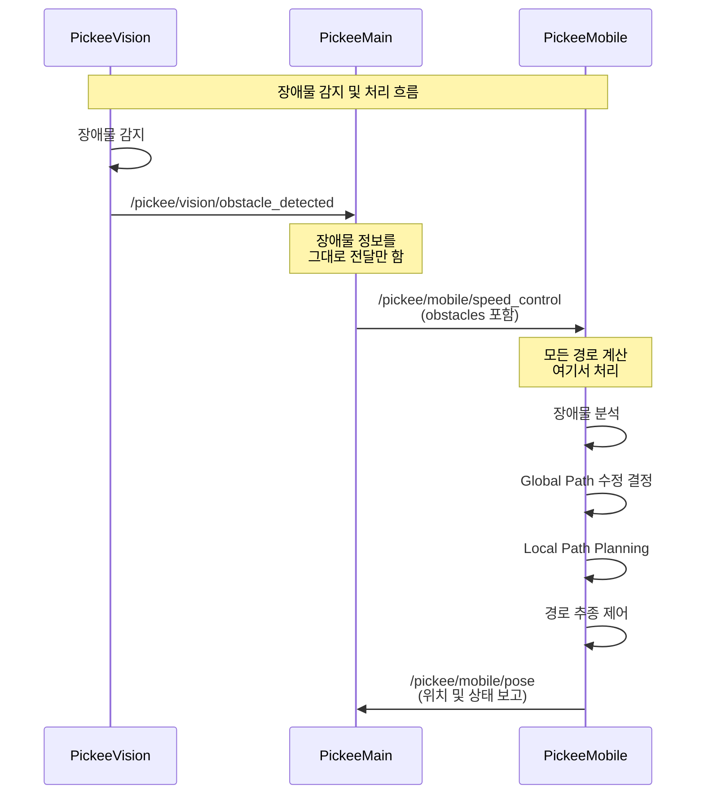

# Pickee Mobile - 주행 알고리즘 집중화 설계

## 1. 개요

기존 설계에서는 **PickeeMain**과 **PickeeMobile** 양쪽에서 모두 주행 관련 계산을 수행하여 비효율적이고 혼란스러운 구조였습니다. 

이 문서는 **모든 주행 알고리즘을 PickeeMobile에 집중**시켜 연산 효율성을 높이고 책임 분리를 명확히 하는 개선된 설계를 제시합니다.

## 2. 역할 재정의

### 2.1. PickeeMain의 역할 (단순화)
- **고수준 상태 관리**: 로봇 상태 기계(State Machine) 관리
- **워크플로우 제어**: 원격 쇼핑 시나리오 워크플로우 실행
- **단순 명령 전달**: Vision 장애물 정보를 Mobile에 그대로 전달
- **결과 수신**: Mobile 도착 알림 및 상태 정보 수신

### 2.2. PickeeMobile의 역할 (확장)
- **모든 주행 알고리즘 집중 처리**:
  - Global Path 계획 및 생성
  - 장애물 정보 기반 Global Path 동적 수정
  - Local Path Planning 및 장애물 회피
  - 경로 추종 제어
- **장애물 분석 및 처리**: Vision 정보 기반 위험도 평가 및 경로 수정
- **위치 추정 및 주행 제어**: 센서 융합 기반 정밀 내비게이션

## 3. 개선된 데이터 흐름



## 4. 장애물 처리 알고리즘

### 4.1. 장애물 분류 및 처리 방식

```python
def analyze_obstacles(self, obstacles: List[Obstacle]) -> ObstacleHandlingStrategy:
    '''
    장애물 분석 및 처리 방식 결정
    '''
    for obstacle in obstacles:
        # 1. 위험도 평가
        risk_level = self._evaluate_risk(obstacle)
        
        # 2. 크기 및 유형 분석
        if obstacle.obstacle_type in ['cart', 'shelf', 'wall']:
            # 큰/정적 장애물: Global Path 수정 필요
            return ObstacleHandlingStrategy.MODIFY_GLOBAL_PATH
        
        elif obstacle.obstacle_type in ['person', 'small_object']:
            # 작은/동적 장애물: Local Path만으로 회피
            return ObstacleHandlingStrategy.LOCAL_AVOIDANCE
        
        # 3. 거리 기반 판단
        if obstacle.distance < CRITICAL_DISTANCE:
            return ObstacleHandlingStrategy.EMERGENCY_STOP
        elif obstacle.distance < WARNING_DISTANCE:
            return ObstacleHandlingStrategy.DECELERATE
    
    return ObstacleHandlingStrategy.NORMAL_OPERATION
```

### 4.2. Global Path 동적 수정

```python
def modify_global_path_for_obstacles(self, obstacles: List[Obstacle]) -> bool:
    '''
    장애물 정보 기반 Global Path 수정
    '''
    current_path = self.current_global_path
    modified_path = []
    
    for waypoint in current_path:
        # 각 waypoint와 장애물 간 충돌 검사
        if self._check_collision_with_obstacles(waypoint, obstacles):
            # 우회 경로 생성
            detour_points = self._generate_detour_path(waypoint, obstacles)
            modified_path.extend(detour_points)
        else:
            modified_path.append(waypoint)
    
    # 수정된 경로가 유효한지 검증
    if self._validate_path(modified_path):
        self.current_global_path = modified_path
        return True
    
    return False
```

## 5. 구현 세부사항

### 5.1. PickeeMain 장애물 콜백 (단순화)

```python
class PickeeMainController:
    def vision_obstacles_callback(self, msg: PickeeVisionObstacles):
        '''
        Vision 장애물 정보를 Mobile에 그대로 전달
        '''
        # 장애물 정보 기반 속도 모드 결정
        if len(msg.obstacles) > 0:
            speed_mode = 'decelerate'
            reason = 'obstacles_detected'
        else:
            speed_mode = 'normal' 
            reason = 'obstacles_cleared'
        
        # Mobile에 정보 전달 (경로 계산은 Mobile에서 처리)
        self.publish_mobile_speed_control(
            robot_id=msg.robot_id,
            order_id=self.current_order_id,
            speed_mode=speed_mode,
            target_speed=0.3 if speed_mode == 'decelerate' else 1.0,
            obstacles=msg.obstacles,  # 장애물 정보 그대로 전달
            reason=reason
        )
```

### 5.2. PickeeMobile 통합 경로 처리

```python
class PickeeMobileController:
    def speed_control_callback(self, msg: PickeeMobileSpeedControl):
        '''
        속도 제어 및 장애물 정보 통합 처리
        '''
        # 1. 장애물 정보 분석
        if msg.obstacles:
            handling_strategy = self.analyze_obstacles(msg.obstacles)
            
            # 2. 처리 방식에 따른 경로 수정
            if handling_strategy == ObstacleHandlingStrategy.MODIFY_GLOBAL_PATH:
                self.modify_global_path_for_obstacles(msg.obstacles)
            elif handling_strategy == ObstacleHandlingStrategy.EMERGENCY_STOP:
                self.emergency_stop()
                return
        
        # 3. 속도 제어 적용
        self.apply_speed_control(msg.speed_mode, msg.target_speed)
        
        # 4. Local Path Planning 업데이트
        self.update_local_path_planning()

    def move_to_location_service(self, request, response):
        '''
        이동 명령 처리 - Global Path 자체 생성 지원
        '''
        # Global Path가 제공되지 않으면 자체 생성
        if not request.global_path:
            self.current_global_path = self.generate_global_path(
                self.current_pose, 
                request.target_pose
            )
        else:
            self.current_global_path = request.global_path
        
        self.target_pose = request.target_pose
        self.start_navigation()
        
        response.success = True
        response.message = "Navigation started with autonomous path planning"
        return response
```

## 6. 성능 및 안전성 향상

### 6.1. 연산 효율성
- **단일 책임**: 주행 알고리즘을 PickeeMobile에 집중하여 중복 연산 제거
- **실시간 처리**: 센서 데이터와 Vision 정보를 Mobile에서 직접 처리하여 지연시간 최소화
- **통합 최적화**: Global/Local Path Planning을 하나의 노드에서 처리하여 최적화 가능

### 6.2. 안전성 강화
- **즉시 대응**: 장애물 정보를 받으면 Mobile에서 즉시 경로 수정 및 속도 조절
- **다층 안전망**: Global Path 수정 + Local Path 회피 + 긴급 정지의 다층 보호
- **센서 융합**: LiDAR, Vision 정보를 통합하여 보다 정확한 장애물 인식

## 7. 마이그레이션 가이드

### 7.1. 기존 코드에서 제거할 부분
- PickeeMain에서 Global Path 계획 관련 코드 제거
- PickeeMain에서 A* 알고리즘 등 경로 계산 코드 제거
- 중복된 장애물 처리 로직 제거

### 7.2. 새로 추가할 부분  
- PickeeMobile에 Global Path 자동 생성 기능 추가
- 장애물 분석 및 Global Path 동적 수정 기능 추가
- 통합된 경로 계획 및 제어 로직 구현

이러한 개선을 통해 주행 알고리즘의 집중화로 시스템 효율성과 안전성을 동시에 확보할 수 있습니다.