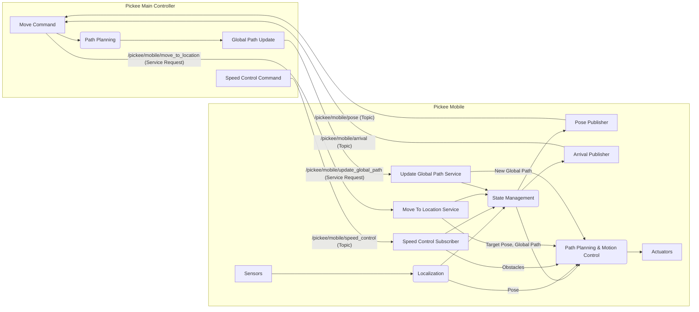

# Shopee Pickee Mobile 상세 설계

## 1. 개요 (Overview)

Pickee Mobile은 Shopee 로봇 쇼핑 시스템의 핵심 구성 요소 중 하나로, Pickee Main Controller의 지시에 따라 지정된 위치로 자율적으로 이동하며 물품 픽업 작업을 지원하는 이동 로봇 플랫폼이다. 주요 역할은 정확한 위치 추정, 효율적인 경로 계획 및 추종, 안전한 이동 제어, 그리고 Pickee Main Controller와의 실시간 통신을 통해 시스템의 전반적인 운영 효율성을 높이는 것이다.

**주요 책임:**
- Pickee Main Controller로부터 이동 명령 수신 및 수행
- 로봇의 현재 위치, 속도, 배터리 잔량 및 상태를 Pickee Main Controller에 주기적으로 보고
- 지정된 목적지에 정확하고 안전하게 도착
- 실시간 센서 데이터를 활용하여 자율 주행 및 장애물 회피
- 배터리 잔량 모니터링 및 보고

## 2. 노드 아키텍처 (Node Architecture)

- **노드 이름**: `pickee_mobile_controller` (가칭)
- **실행 파일**: `shopee_pickee_mobile/mobile_controller.py` (가칭)
- **실행 방식**: `ros2 run shopee_pickee_mobile mobile_controller` (가칭)

Pickee Mobile은 ROS2 기반으로 개발되며, 다음과 같은 주요 노드 및 컴포넌트로 구성된다.

*   **Localization Node:** 센서 데이터를 활용하여 로봇의 현재 위치를 정확하게 추정한다.
*   **Path Planning Node:** Pickee Main Controller로부터 받은 전역 경로를 기반으로 지역 경로를 계획하고, 실시간 장애물 정보를 반영하여 안전하고 효율적인 경로를 생성한다.
*   **Motion Control Node:** Path Planning Node에서 생성된 경로를 추종하며 로봇의 모터 및 조향을 제어한다.
*   **State Management Node:** Pickee Mobile의 현재 상태(이동 중, 정지, 대기, 오류 등)를 관리하고, 각 상태에 따른 동작을 제어한다.
*   **Communication Node:** Pickee Main Controller와의 ROS2 통신 인터페이스를 담당한다.
*   **Actuators & Sensors:** 로봇의 이동을 위한 모터 및 엔코더, 환경 인식을 위한 LiDAR, 카메라, IMU 등의 센서.

## 3. 상태 관리 (State Management)

Pickee Mobile의 주요 상태는 다음과 같이 정의되며, 각 상태는 클래스로 정의되어 상태 진입(on_enter), 실행(execute), 이탈(on_exit) 로직을 포함할 수 있다.

| 상태 (State) | 영문명 | 주요 역할 | 다음 상태 전이 조건 |
|---|---|---|---|
| 대기중 | `IDLE` | Pickee Main Controller의 명령 대기 | `/pickee/mobile/move_to_location` 서비스 요청 수신 |
| 이동중 | `MOVING` | 지정된 목적지로 이동 | 목적지 도착 감지 또는 `/pickee/mobile/speed_control` (stop) 수신 |
| 정지 | `STOPPED` | 이동 중단 (장애물, 명령 등) | 장애물 해소 또는 `/pickee/mobile/speed_control` (normal/decelerate) 수신 |
| 충전중 | `CHARGING` | 배터리 충전 | 배터리 임계값 이상 충전 완료 |
| 오류 | `ERROR` | 시스템 오류 발생 | 오류 해결 및 재시작 명령 수신 |

## 4. 인터페이스 상세 (Interface Specification)

### 4.1. 외부 인터페이스 (vs. Pickee Main Controller)

#### Service Servers
- `/pickee/mobile/move_to_location` (`shopee_interfaces/srv/PickeeMobileMoveToLocation.srv`): Pickee Main Controller로부터 특정 목적지로 이동하라는 명령을 수신하고, 이동을 시작한다.
- `/pickee/mobile/update_global_path` (`shopee_interfaces/srv/PickeeMobileUpdateGlobalPath.srv`): Pickee Main Controller로부터 전역 경로 업데이트 명령을 수신하고, 현재 이동 중인 경로를 업데이트한다.

#### Publishers
- `/pickee/mobile/pose` (`shopee_interfaces/msg/PickeeMobilePose.msg`): Pickee Mobile의 현재 위치, 속도, 배터리 잔량 및 상태를 Pickee Main Controller에 주기적으로 보고한다.
- `/pickee/mobile/arrival` (`shopee_interfaces/msg/PickeeMobileArrival.msg`): Pickee Mobile이 지정된 목적지에 도착했음을 Pickee Main Controller에 알린다.

#### Subscribers
- `/pickee/mobile/speed_control` (`shopee_interfaces/msg/PickeeMobileSpeedControl.msg`): Pickee Main Controller로부터 Pickee Mobile의 속도 제어 명령을 수신한다.

### 4.2. 내부 인터페이스 (vs. Sensors, Actuators)

*   **Sensors:**
    *   LiDAR: 주변 환경 인식 및 장애물 감지
    *   IMU: 로봇의 자세 및 움직임 감지
    *   Encoder: 바퀴 회전 정보 및 주행 거리 측정
    *   Camera: 추가적인 환경 인식 및 특정 기능 (예: QR 코드 인식)
*   **Actuators:**
    *   Motor Driver: 로봇의 바퀴 모터 제어
    *   Steering Actuator: 로봇의 조향 제어

## 5. 주요 기능 로직 (Key Logic)

### 5.1. 위치 추정 및 보고 (Localization & Reporting)
*   **로직:** 엔코더, IMU, LiDAR, 카메라 등 다양한 센서 데이터를 융합하여 로봇의 2D 위치(x, y, theta)를 실시간으로 추정한다. 이를 위해 AMCL(Adaptive Monte Carlo Localization) 또는 EKF(Extended Kalman Filter)와 같은 알고리즘을 활용할 수 있다.
*   **보고:** 추정된 위치 정보와 함께 현재 선속도, 각속도, 배터리 잔량, 로봇 상태를 `/pickee/mobile/pose` 토픽을 통해 Pickee Main Controller에 주기적으로 발행한다. 발행 주기는 100ms로 설정하여 실시간성을 확보한다.

### 5.2. 경로 계획 및 추종 (Path Planning & Following)
*   **전역 경로 수신:** `/pickee/mobile/move_to_location` 서비스 요청 시 Pickee Main Controller로부터 전역 경로(`global_path`)를 수신한다. 이 경로는 로봇이 따라야 할 고수준의 경로이다.
*   **지역 경로 계획:** 수신된 전역 경로와 실시간 센서 데이터(LiDAR 등)를 기반으로 동적 장애물을 회피하며 로봇이 따라갈 지역 경로를 계획한다. DWA(Dynamic Window Approach) 또는 TEB(Timed-Elastic Band)와 같은 지역 경로 계획 알고리즘을 활용하여 안전하고 효율적인 경로를 생성한다.
*   **경로 추종:** 계획된 지역 경로를 따라 로봇을 정밀하게 제어하여 목표 포즈에 도달하도록 한다. PID 제어기 또는 Model Predictive Control(MPC)과 같은 제어 기법을 적용하여 경로 추종 성능을 최적화한다.
*   **경로 업데이트:** `/pickee/mobile/update_global_path` 서비스 요청 시 새로운 전역 경로로 업데이트하여 Pickee Main Controller의 지시에 따라 유연한 경로 변경을 지원한다.

### 5.3. 속도 제어 (Speed Control)
*   **명령 수신:** `/pickee/mobile/speed_control` 토픽을 통해 Pickee Main Controller로부터 `speed_mode` (normal, decelerate, stop) 및 `target_speed` 명령을 수신한다.
*   **안전 제어:** 수신된 명령과 로봇 주변의 장애물 정보(`obstacles`)를 종합하여 로봇의 속도를 안전하게 조절한다. 특히 `stop` 명령이나 충돌 위험 감지 시 즉시 정지하고, 장애물과의 거리에 따라 `decelerate` 모드로 전환하여 속도를 줄인다.

### 5.4. 도착 감지 (Arrival Detection)
*   **판단 기준:** 로봇의 현재 위치가 `target_pose`로부터 일정 거리 및 각도 오차 범위 내에 들어오면 목적지에 도착한 것으로 판단한다. 이 오차 범위는 로봇의 정밀도 요구사항에 따라 설정한다.
*   **보고:** 도착 감지 시 `/pickee/mobile/arrival` 토픽을 통해 Pickee Main Controller에 도착 정보를 보고한다. 이때 최종 포즈, 위치 오차, 이동 시간 등의 상세 정보를 포함한다.

### 5.5. 배터리 관리 (Battery Management)
*   **모니터링:** 로봇의 배터리 잔량을 지속적으로 모니터링한다.
*   **보고:** `/pickee/mobile/pose` 토픽을 통해 배터리 잔량을 주기적으로 보고한다. 배터리 잔량이 특정 임계치 이하로 떨어지면 Pickee Main Controller에 경고를 보내고 충전 스테이션으로 자동 복귀하는 로직을 구현할 수 있다.

### 5.6. 상태 관리 (State Management)
*   **상태 정의:** Pickee Mobile의 주요 상태를 `IDLE`, `MOVING`, `STOPPED`, `ERROR`, `CHARGING` 등으로 정의한다.
*   **상태 전이:** 각 상태 간의 전이 조건을 명확히 정의하고, 상태 전이에 따라 로봇의 동작을 제어한다. 예를 들어, `IDLE` 상태에서 `move_to_location` 서비스 요청을 받으면 `MOVING` 상태로 전이된다.

## 6. 파라미터 (ROS2 Parameters)

- `robot_id` (int): 로봇의 고유 ID. (기본값: 1)
- `default_linear_speed` (float): 기본 주행 선속도. (기본값: 0.5 m/s)
- `default_angular_speed` (float): 기본 주행 각속도. (기본값: 0.3 rad/s)
- `battery_threshold_low` (float): 배터리 부족 경고 임계값. (기본값: 20.0 %)
- `arrival_position_tolerance` (float): 목적지 도착 판단을 위한 위치 허용 오차. (기본값: 0.05 m)
- `arrival_angle_tolerance` (float): 목적지 도착 판단을 위한 각도 허용 오차. (기본값: 0.1 rad)
- `path_planning_frequency` (float): 지역 경로 계획 주기. (기본값: 10.0 Hz)
- `motion_control_frequency` (float): 모션 제어 주기. (기본값: 20.0 Hz)

## 7. 데이터 흐름 (Data Flow)

## 8. 오류 처리 (Error Handling)

*   **통신 오류:** ROS2 통신 단절 또는 메시지 손실 발생 시 재시도 메커니즘 및 오류 보고.
*   **센서 오류:** 센서 데이터 이상 감지 시 대체 센서 사용 또는 안전 정지.
*   **이동 오류:** 경로 이탈, 장애물 충돌 위험, 모터 이상 등 이동 중 발생할 수 있는 오류에 대한 감지 및 복구 로직 (예: 재시도, 경로 재계획, 안전 정지).
*   **배터리 부족:** 배터리 잔량 임계치 이하 시 Pickee Main Controller에 경고 보고 및 충전 스테이션으로 자동 복귀.

## 9. 코딩 표준 (Coding Standards)

*   **ROS2 표준:**
    *   Package Names: `snake_case`
    *   Node/Topic/Service/Action/Parameter Names: `snake_case`
    *   Type Names: `PascalCase`
    *   Type Field Names: `snake_case`
    *   Type Constants Names: `SCREAMING_SNAKE_CASE`
*   **Python 표준:**
    *   Package 및 module 이름: `snake_case`
    *   Class 및 exception 이름: `PascalCase`
    *   Function, method, parameter, local/instance/global 변수 이름: `snake_case`
    *   Global/Class constants: `SCREAMING_SNAKE_CASE`
*   **공통 규칙:**
    *   주석은 한국어로 작성 (`#`)
    *   함수와 함수 사이 1줄 간격
    *   Import문은 한줄에 하나씩
    *   제어문은 반드시 중괄호 사용 (Python에서는 해당 없음, C++에 적용)
    *   문자열은 작은따옴표 사용