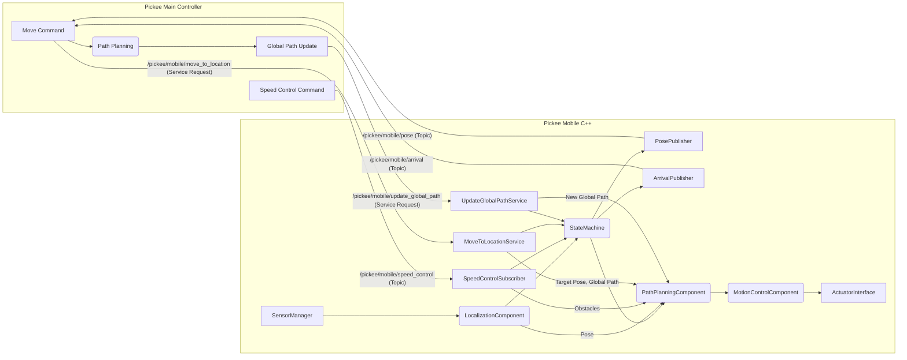

# Shopee Pickee Mobile 상세 설계 (C++ 버전)

## 1. 개요 (Overview)

Pickee Mobile은 Shopee 로봇 쇼핑 시스템의 핵심 구성 요소 중 하나로, Pickee Main Controller의 지시에 따라 지정된 위치로 자율적으로 이동하며 물품 픽업 작업을 지원하는 이동 로봇 플랫폼이다. 주요 역할은 정확한 위치 추정, 효율적인 경로 계획 및 추종, 안전한 이동 제어, 그리고 Pickee Main Controller와의 실시간 통신을 통해 시스템의 전반적인 운영 효율성을 높이는 것이다.

**주요 책임:**
- Pickee Main Controller로부터 이동 명령 수신 및 수행
- 로봇의 현재 위치, 속도, 배터리 잔량 및 상태를 Pickee Main Controller에 주기적으로 보고
- 지정된 목적지에 정확하고 안전하게 도착
- 모든 주행 알고리즘 집중 처리: Global Path 계획/수정, Local Path Planning, 장애물 회피
- Vision에서 제공하는 장애물 정보 기반 경로 계획 및 동적 수정
- 실시간 센서 데이터를 활용하여 자율 주행 및 장애물 회피
- 배터리 잔량 모니터링 및 보고

## 2. 노드 아키텍처 (Node Architecture)

- **노드 이름**: `pickee_mobile_controller`
- **실행 파일**: `pickee_mobile_controller` (CMake target)
- **실행 방식**: `ros2 run pickee_mobile pickee_mobile_controller`

Pickee Mobile은 ROS2 C++로 개발되며, 다음과 같은 주요 노드 및 컴포넌트로 구성된다.

*   **LocalizationComponent:** 센서 데이터를 활용하여 로봇의 현재 위치를 정확하게 추정한다. `std::shared_ptr<LocalizationComponent>`로 관리되며, RAII 패턴을 적용한다.
*   **PathPlanningComponent:** 목적지 정보를 기반으로 Global Path를 생성하고, Vision에서 제공되는 장애물 정보를 반영하여 Global Path를 동적으로 수정한다. 또한 실시간 센서 데이터를 활용해 Local Path를 계획하여 안전하고 효율적인 경로를 생성한다.
*   **MotionControlComponent:** Path Planning Component에서 생성된 경로를 추종하며 로봇의 모터 및 조향을 제어한다. Real-time 제어를 위한 고성능 C++ 구현이 적용된다.
*   **StateMachine:** Pickee Mobile의 현재 상태(이동 중, 정지, 대기, 오류 등)를 관리하고, 각 상태에 따른 동작을 제어한다. `std::unique_ptr<State>` 기반 상태 패턴을 사용한다.
*   **CommunicationInterface:** Pickee Main Controller와의 ROS2 통신 인터페이스를 담당한다. `rclcpp::Service`, `rclcpp::Publisher`, `rclcpp::Subscription` 등을 활용한다.
*   **SensorManager:** 로봇의 이동을 위한 모터 및 엔코더, 환경 인식을 위한 LiDAR, 카메라, IMU 등의 센서 데이터를 통합 관리한다.

## 3. 상태 관리 (State Management)

Pickee Mobile의 주요 상태는 다음과 같이 정의되며, 각 상태는 `State` 추상 기본 클래스를 상속받는 클래스로 구현되어 상태 진입(`OnEnter()`), 실행(`Execute()`), 이탈(`OnExit()`) 로직을 포함한다.

| 상태 (State) | 클래스명 | 주요 역할 | 다음 상태 전이 조건 |
|---|---|---|---|
| 대기중 | `IdleState` | Pickee Main Controller의 명령 대기 | `/pickee/mobile/move_to_location` 서비스 요청 수신 |
| 이동중 | `MovingState` | 지정된 목적지로 이동 | 목적지 도착 감지 또는 `/pickee/mobile/speed_control` (stop/decelerate) 수신 |
| 정지 | `StoppedState` | 이동 중단 (장애물, 명령 등) | 장애물 해소 또는 `/pickee/mobile/speed_control` (normal/decelerate) 수신 |
| 충전중 | `ChargingState` | 배터리 충전 | 배터리 임계값 이상 충전 완료 |
| 오류 | `ErrorState` | 시스템 오류 발생 | 오류 해결 및 재시작 명령 수신 |

### 3.1. 상태 클래스 구조

```cpp
// include/pickee_mobile/states/state.hpp
class State {
public:
    virtual ~State() = default;
    virtual void OnEnter() = 0;
    virtual void Execute() = 0;
    virtual void OnExit() = 0;
    virtual StateType GetType() const = 0;
};

// include/pickee_mobile/state_machine.hpp
class StateMachine {
private:
    std::unique_ptr<State> current_state_;
    std::shared_ptr<rclcpp::Logger> logger_;
    
public:
    explicit StateMachine(std::shared_ptr<rclcpp::Logger> logger);
    void TransitionTo(std::unique_ptr<State> new_state);
    void Execute();
    StateType GetCurrentStateType() const;
};
```

## 4. 인터페이스 상세 (Interface Specification)

### 4.1. 외부 인터페이스 (vs. Pickee Main Controller)

#### Service Servers
- `/pickee/mobile/move_to_location` (`shopee_interfaces/srv/PickeeMobileMoveToLocation.srv`): Pickee Main Controller로부터 특정 목적지로 이동하라는 명령을 수신하고, 이동을 시작한다.
  ```cpp
  rclcpp::Service<shopee_interfaces::srv::PickeeMobileMoveToLocation>::SharedPtr move_to_location_service_;
  ```

- `/pickee/mobile/update_global_path` (`shopee_interfaces/srv/PickeeMobileUpdateGlobalPath.srv`): Pickee Main Controller로부터 전역 경로 업데이트 명령을 수신하고, 현재 이동 중인 경로를 업데이트한다.
  ```cpp
  rclcpp::Service<shopee_interfaces::srv::PickeeMobileUpdateGlobalPath>::SharedPtr update_global_path_service_;
  ```

#### Publishers
- `/pickee/mobile/pose` (`shopee_interfaces/msg/PickeeMobilePose.msg`): Pickee Mobile의 현재 위치, 속도, 배터리 잔량 및 상태를 Pickee Main Controller에 주기적으로 보고한다.
  ```cpp
  rclcpp::Publisher<shopee_interfaces::msg::PickeeMobilePose>::SharedPtr pose_publisher_;
  rclcpp::TimerBase::SharedPtr pose_timer_;  // 100ms 주기
  ```

- `/pickee/mobile/arrival` (`shopee_interfaces/msg/PickeeMobileArrival.msg`): Pickee Mobile이 지정된 목적지에 도착했음을 Pickee Main Controller에 알린다.
  ```cpp
  rclcpp::Publisher<shopee_interfaces::msg::PickeeMobileArrival>::SharedPtr arrival_publisher_;
  ```

#### Subscribers
- `/pickee/mobile/speed_control` (`shopee_interfaces/msg/PickeeMobileSpeedControl.msg`): Pickee Main Controller로부터 Pickee Mobile의 속도 제어 명령을 수신한다.
  ```cpp
  rclcpp::Subscription<shopee_interfaces::msg::PickeeMobileSpeedControl>::SharedPtr speed_control_subscription_;
  ```

### 4.2. 내부 인터페이스 (vs. Sensors, Actuators)

*   **Sensors:**
    *   LiDAR: `sensor_msgs::msg::LaserScan` 토픽 구독 및 실시간 처리
    *   IMU: `sensor_msgs::msg::Imu` 토픽 구독 및 칼만 필터링
    *   Encoder: `nav_msgs::msg::Odometry` 토픽 구독 및 데드 레코닝
    *   Camera: `sensor_msgs::msg::Image` 토픽 구독 및 OpenCV 처리
*   **Actuators:**
    *   Motor Driver: `geometry_msgs::msg::Twist` 토픽 발행 (`/cmd_vel`)
    *   Steering Actuator: 로봇의 조향 제어 (`std_msgs::msg::Float64` 등)

### 4.3. Transform 관리

```cpp
#include <tf2_ros/transform_broadcaster.h>
#include <tf2_ros/transform_listener.h>
#include <tf2_ros/buffer.h>

class PickeeMobileController : public rclcpp::Node {
private:
    std::unique_ptr<tf2_ros::TransformBroadcaster> tf_broadcaster_;
    std::shared_ptr<tf2_ros::TransformListener> tf_listener_;
    std::unique_ptr<tf2_ros::Buffer> tf_buffer_;
};
```

## 5. 주요 기능 로직 (Key Logic)

### 5.1. 위치 추정 및 보고 (Localization & Reporting)
*   **알고리즘:** 엔코더, IMU, LiDAR, 카메라 등 다양한 센서 데이터를 융합하여 로봇의 2D 위치(x, y, theta)를 실시간으로 추정한다. AMCL(Adaptive Monte Carlo Localization) 또는 EKF(Extended Kalman Filter) C++ 라이브러리 활용.
*   **성능 최적화:** Eigen 라이브러리를 활용한 행렬 연산 최적화 및 SIMD 명령어 활용.
*   **보고:** `rclcpp::TimerBase`를 사용하여 100ms 주기로 위치 정보를 발행.

```cpp
class LocalizationComponent {
private:
    Eigen::Vector3d current_pose_;  // [x, y, theta]
    Eigen::Matrix3d pose_covariance_;
    std::shared_ptr<KalmanFilter> ekf_filter_;
    
public:
    void UpdateSensorData(const sensor_msgs::msg::LaserScan::SharedPtr scan);
    void UpdateOdometry(const nav_msgs::msg::Odometry::SharedPtr odom);
    Eigen::Vector3d GetCurrentPose() const;
    Eigen::Matrix3d GetPoseCovariance() const;
};
```

### 5.2. 경로 계획 및 추종 (Path Planning & Following)
*   **전역 경로 생성:** A* 알고리즘의 고성능 C++ 구현으로 Grid-based path planning 수행.
*   **지역 경로 계획:** DWA(Dynamic Window Approach) 또는 TEB(Timed-Elastic Band) 알고리즘을 C++로 구현하여 실시간 장애물 회피.
*   **경로 추종:** PID 제어기 또는 Model Predictive Control(MPC)을 C++로 구현하여 정밀한 경로 추종.

```cpp
class PathPlanningComponent {
private:
    std::unique_ptr<AStarPlanner> global_planner_;
    std::unique_ptr<DWAPlanner> local_planner_;
    nav_msgs::msg::Path global_path_;
    nav_msgs::msg::Path local_path_;
    
public:
    bool PlanGlobalPath(const geometry_msgs::msg::PoseStamped& start, 
                       const geometry_msgs::msg::PoseStamped& goal);
    bool PlanLocalPath(const sensor_msgs::msg::LaserScan::SharedPtr scan);
    void UpdateObstacles(const std::vector<geometry_msgs::msg::Point>& obstacles);
};
```

### 5.3. 속도 제어 및 장애물 처리 (Speed Control & Obstacle Handling)
*   **실시간 제어:** 고빈도 제어 루프(50-100Hz)를 위한 최적화된 C++ 구현.
*   **안전 제어:** Emergency stop 및 collision avoidance를 위한 interrupt-driven 안전 로직.

```cpp
class MotionControlComponent {
private:
    std::unique_ptr<PIDController> linear_pid_;
    std::unique_ptr<PIDController> angular_pid_;
    geometry_msgs::msg::Twist current_cmd_vel_;
    std::atomic<bool> emergency_stop_;
    
public:
    void UpdateTargetPath(const nav_msgs::msg::Path& path);
    geometry_msgs::msg::Twist ComputeControlCommand(const Eigen::Vector3d& current_pose);
    void EmergencyStop();
    void SetSpeedLimits(double max_linear, double max_angular);
};
```

### 5.4. 도착 감지 (Arrival Detection)
*   **정밀도:** 고정밀 거리 및 각도 계산을 위한 Eigen 라이브러리 활용.
*   **효율성:** 연산 최적화를 위한 거리 제곱 비교 및 조기 종료 로직.

```cpp
class ArrivalDetector {
private:
    double position_tolerance_;
    double angle_tolerance_;
    
public:
    bool IsArrived(const Eigen::Vector3d& current_pose, 
                  const geometry_msgs::msg::PoseStamped& target_pose) const;
    void SetTolerances(double pos_tol, double ang_tol);
};
```

### 5.5. 배터리 관리 (Battery Management)
*   **모니터링:** 배터리 상태를 실시간으로 추적하고 예측 알고리즘 적용.
*   **효율성:** 배터리 데이터의 메모리 효율적 관리 및 이력 추적.

```cpp
class BatteryManager {
private:
    std::atomic<double> battery_level_;
    std::deque<std::pair<rclcpp::Time, double>> battery_history_;
    double low_battery_threshold_;
    
public:
    void UpdateBatteryLevel(double level);
    double GetCurrentLevel() const;
    bool IsLowBattery() const;
    double EstimateRemainingTime() const;
};
```

### 5.6. 상태 관리 (State Management)
*   **성능:** `std::unique_ptr`을 활용한 효율적인 상태 전환 및 메모리 관리.
*   **안전성:** 상태 전환 시 exception safety 및 RAII 패턴 적용.

## 6. 파라미터 (ROS2 Parameters)

```cpp
// 파라미터 선언 및 초기화
class PickeeMobileController : public rclcpp::Node {
private:
    void DeclareParameters() {
        this->declare_parameter("robot_id", 1);
        this->declare_parameter("default_linear_speed", 0.5);
        this->declare_parameter("default_angular_speed", 0.3);
        this->declare_parameter("battery_threshold_low", 20.0);
        this->declare_parameter("arrival_position_tolerance", 0.05);
        this->declare_parameter("arrival_angle_tolerance", 0.1);
        this->declare_parameter("path_planning_frequency", 10.0);
        this->declare_parameter("motion_control_frequency", 20.0);
    }
    
    void LoadParameters() {
        robot_id_ = this->get_parameter("robot_id").as_int();
        default_linear_speed_ = this->get_parameter("default_linear_speed").as_double();
        // ... 기타 파라미터 로딩
    }
};
```

- `robot_id` (int): 로봇의 고유 ID. (기본값: 1)
- `default_linear_speed` (double): 기본 주행 선속도. (기본값: 0.5 m/s)
- `default_angular_speed` (double): 기본 주행 각속도. (기본값: 0.3 rad/s)
- `battery_threshold_low` (double): 배터리 부족 경고 임계값. (기본값: 20.0 %)
- `arrival_position_tolerance` (double): 목적지 도착 판단을 위한 위치 허용 오차. (기본값: 0.05 m)
- `arrival_angle_tolerance` (double): 목적지 도착 판단을 위한 각도 허용 오차. (기본값: 0.1 rad)
- `path_planning_frequency` (double): 지역 경로 계획 주기. (기본값: 10.0 Hz)
- `motion_control_frequency` (double): 모션 제어 주기. (기본값: 20.0 Hz)

## 7. 데이터 흐름 (Data Flow)



## 8. 오류 처리 (Error Handling)

### 8.1. Exception Safety
```cpp
class PickeeMobileController : public rclcpp::Node {
private:
    void SafeExecute(std::function<void()> func, const std::string& operation_name) {
        try {
            func();
        } catch (const std::exception& e) {
            RCLCPP_ERROR(this->get_logger(), 
                        "Error in %s: %s", operation_name.c_str(), e.what());
            TransitionToErrorState();
        }
    }
};
```

*   **통신 오류:** ROS2 통신 단절 또는 메시지 손실 발생 시 재시도 메커니즘 및 오류 보고. `rclcpp::QoS` 설정을 통한 신뢰성 향상.
*   **센서 오류:** 센서 데이터 이상 감지 시 대체 센서 사용 또는 안전 정지. `std::optional` 활용한 안전한 센서 데이터 처리.
*   **이동 오류:** 경로 이탈, 장애물 충돌 위험, 모터 이상 등 이동 중 발생할 수 있는 오류에 대한 감지 및 복구 로직.
*   **메모리 오류:** 스마트 포인터 및 RAII 패턴을 통한 메모리 누수 방지.
*   **배터리 부족:** `std::atomic<double>`을 활용한 thread-safe 배터리 모니터링.

### 8.2. 로깅 및 진단
```cpp
// 성능 프로파일링을 위한 타이머 클래스
class PerformanceTimer {
private:
    std::chrono::high_resolution_clock::time_point start_time_;
    std::string operation_name_;
    
public:
    explicit PerformanceTimer(const std::string& name) 
        : operation_name_(name), start_time_(std::chrono::high_resolution_clock::now()) {}
    
    ~PerformanceTimer() {
        auto end_time = std::chrono::high_resolution_clock::now();
        auto duration = std::chrono::duration_cast<std::chrono::microseconds>(end_time - start_time_);
        RCLCPP_DEBUG(rclcpp::get_logger("performance"), 
                    "%s took %ld microseconds", operation_name_.c_str(), duration.count());
    }
};
```

## 9. 성능 최적화 (Performance Optimization)

### 9.1. 메모리 관리
```cpp
// 메모리 풀을 활용한 고빈도 객체 관리
template<typename T>
class ObjectPool {
private:
    std::queue<std::unique_ptr<T>> pool_;
    std::mutex pool_mutex_;
    
public:
    std::unique_ptr<T> Acquire() {
        std::lock_guard<std::mutex> lock(pool_mutex_);
        if (pool_.empty()) {
            return std::make_unique<T>();
        }
        auto obj = std::move(pool_.front());
        pool_.pop();
        return obj;
    }
    
    void Release(std::unique_ptr<T> obj) {
        obj->Reset();  // 객체 상태 초기화
        std::lock_guard<std::mutex> lock(pool_mutex_);
        pool_.push(std::move(obj));
    }
};
```

### 9.2. 실시간 성능
```cpp
// Lock-free 링 버퍼를 활용한 센서 데이터 처리
template<typename T, size_t Size>
class LockFreeRingBuffer {
private:
    std::array<T, Size> buffer_;
    std::atomic<size_t> head_{0};
    std::atomic<size_t> tail_{0};
    
public:
    bool Push(const T& item) {
        size_t current_tail = tail_.load();
        size_t next_tail = (current_tail + 1) % Size;
        if (next_tail == head_.load()) {
            return false;  // 버퍼 풀
        }
        buffer_[current_tail] = item;
        tail_.store(next_tail);
        return true;
    }
    
    bool Pop(T& item) {
        size_t current_head = head_.load();
        if (current_head == tail_.load()) {
            return false;  // 버퍼 비어있음
        }
        item = buffer_[current_head];
        head_.store((current_head + 1) % Size);
        return true;
    }
};
```

## 10. 코딩 표준 (Coding Standards)

*   **ROS2 표준:**
    *   Package Names: `snake_case`
    *   Node/Topic/Service/Action/Parameter Names: `snake_case`
    *   Type Names: `PascalCase`
    *   Type Field Names: `snake_case`
    *   Type Constants Names: `SCREAMING_SNAKE_CASE`

*   **C++ 표준:**
    *   File Names: `snake_case`
    *   Type Names: `PascalCase`
    *   Function Names: `PascalCase` (접근자는 `snake_case`)
    *   Variable Names: `snake_case` (클래스 멤버는 `_suffix`)
    *   Constant Names: `k` + `PascalCase`
    *   Macro Names: `SCREAMING_SNAKE_CASE`
    *   Namespace Names: `snake_case`

*   **공통 규칙:**
    *   주석은 한국어로 작성 (`//`)
    *   세로 간격: 함수와 함수 사이 1줄, 블록 사이 1줄, 헤더와 본문 사이 2줄
    *   Include문은 한줄에 하나씩
    *   제어문은 반드시 중괄호 사용
    *   문자열은 큰따옴표 사용
    *   들여쓰기: 2칸

*   **C++ 특화 규칙:**
    *   Modern C++ (C++14/17) 기능 적극 활용
    *   `auto` 키워드 적절한 사용
    *   Range-based for loop 사용 권장
    *   `nullptr` 사용 (NULL 대신)
    *   `std::` 접두사 명시적 사용 (using namespace std 금지)
    *   헤더 가드 대신 `#pragma once` 사용
    *   const correctness 준수
    *   RAII(Resource Acquisition Is Initialization) 패턴 준수
    *   스마트 포인터 사용 (`std::unique_ptr`, `std::shared_ptr`)

## 11. 빌드 및 테스트 (Build & Testing)

### 11.1. CMakeLists.txt 구성 예시
```cmake
cmake_minimum_required(VERSION 3.8)
project(pickee_mobile)

# C++ 표준 설정
if(NOT CMAKE_CXX_STANDARD)
  set(CMAKE_CXX_STANDARD 17)
endif()

# 컴파일러 옵션
if(CMAKE_COMPILER_IS_GNUCXX OR CMAKE_CXX_COMPILER_ID MATCHES "Clang")
  add_compile_options(-Wall -Wextra -Wpedantic -O3 -march=native)
endif()

# ROS2 의존성
find_package(ament_cmake REQUIRED)
find_package(rclcpp REQUIRED)
find_package(shopee_interfaces REQUIRED)
find_package(geometry_msgs REQUIRED)
find_package(sensor_msgs REQUIRED)
find_package(nav_msgs REQUIRED)
find_package(tf2_ros REQUIRED)
find_package(Eigen3 REQUIRED)

# 실행 파일 생성
add_executable(pickee_mobile_controller
  src/main.cpp
  src/mobile_controller.cpp
  src/components/localization_component.cpp
  src/components/path_planning_component.cpp
  src/components/motion_control_component.cpp
  src/state_machine.cpp
  src/states/idle_state.cpp
  src/states/moving_state.cpp
  src/states/stopped_state.cpp
  src/states/charging_state.cpp
  src/states/error_state.cpp
)

# 헤더 파일 경로
target_include_directories(pickee_mobile_controller PUBLIC
  $<BUILD_INTERFACE:${CMAKE_CURRENT_SOURCE_DIR}/include>
  $<INSTALL_INTERFACE:include>)

# 의존성 링크
target_link_libraries(pickee_mobile_controller Eigen3::Eigen)

ament_target_dependencies(pickee_mobile_controller
  rclcpp
  shopee_interfaces
  geometry_msgs
  sensor_msgs
  nav_msgs
  tf2_ros
)

# 설치
install(TARGETS pickee_mobile_controller
  DESTINATION lib/${PROJECT_NAME})

# 설정 파일 설치
install(DIRECTORY config launch
  DESTINATION share/${PROJECT_NAME})

# 테스트
if(BUILD_TESTING)
  find_package(ament_cmake_gtest REQUIRED)
  
  ament_add_gtest(test_state_machine
    test/test_state_machine.cpp
    src/state_machine.cpp
  )
  
  target_include_directories(test_state_machine PUBLIC
    $<BUILD_INTERFACE:${CMAKE_CURRENT_SOURCE_DIR}/include>)
    
  ament_target_dependencies(test_state_machine rclcpp)
endif()

ament_package()
```

### 11.2. 단위 테스트 예시
```cpp
// test/test_state_machine.cpp
#include <gtest/gtest.h>
#include <rclcpp/rclcpp.hpp>
#include "pickee_mobile/state_machine.hpp"
#include "pickee_mobile/states/idle_state.hpp"
#include "pickee_mobile/states/moving_state.hpp"

class StateMachineTest : public ::testing::Test {
protected:
    void SetUp() override {
        rclcpp::init(0, nullptr);
        auto logger = std::make_shared<rclcpp::Logger>(rclcpp::get_logger("test"));
        state_machine_ = std::make_unique<StateMachine>(logger);
    }
    
    void TearDown() override {
        rclcpp::shutdown();
    }
    
    std::unique_ptr<StateMachine> state_machine_;
};

TEST_F(StateMachineTest, InitialState) {
    EXPECT_EQ(state_machine_->GetCurrentStateType(), StateType::IDLE);
}

TEST_F(StateMachineTest, StateTransition) {
    auto moving_state = std::make_unique<MovingState>();
    state_machine_->TransitionTo(std::move(moving_state));
    EXPECT_EQ(state_machine_->GetCurrentStateType(), StateType::MOVING);
}
```