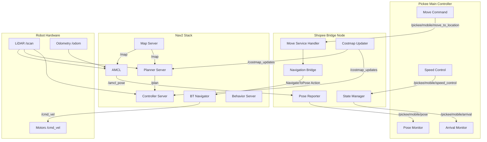

# Shopee Pickee Mobile 상세 설계 (Nav2 기반 C++ 버전)

## 1. 개요 (Overview)

Pickee Mobile은 Shopee 로봇 쇼핑 시스템의 핵심 구성 요소 중 하나로, **ROS2 Nav2 스택을 기반**으로 하여 Pickee Main Controller의 지시에 따라 지정된 위치로 자율적으로 이동하며 물품 픽업 작업을 지원하는 이동 로봇 플랫폼이다. Nav2의 검증된 네비게이션 알고리즘들을 활용하면서 Shopee 시스템에 특화된 통신 인터페이스를 제공한다.

**주요 아키텍처:**
- **Nav2 기반 네비게이션**: AMCL 로컬라이제이션, Nav2 경로 계획, BehaviorTree 네비게이터
- **브리지 노드**: Nav2와 Shopee 시스템 간의 통신 인터페이스 제공
- **상태 관리**: 로봇의 현재 상태 및 미션 진행 상황 관리

**주요 책임:**
- Pickee Main Controller로부터 이동 명령 수신 및 Nav2로 전달
- Nav2를 통한 정확한 위치 추정 (AMCL) 및 경로 계획
- 로봇의 현재 위치, 속도, 배터리 잔량 및 상태를 Pickee Main Controller에 주기적으로 보고
- Nav2의 GlobalPlanner와 LocalPlanner를 활용한 안전하고 효율적인 네비게이션
- Vision에서 제공하는 장애물 정보를 costmap에 반영하여 동적 경로 수정
- 배터리 잔량 모니터링 및 보고

## 2. 시스템 아키텍처 (System Architecture)

### 2.1. Nav2 기반 구성요소

**Nav2 표준 노드들:**
- **map_server**: 미리 생성된 맵 파일(`shopee_map3.yaml`) 제공
- **amcl**: Adaptive Monte Carlo Localization으로 로봇 위치 추정
- **planner_server**: A* 알고리즘 기반 전역 경로 계획
- **controller_server**: DWB 컨트롤러를 통한 지역 경로 추종
- **behavior_server**: 복구 동작 (백업, 스핀, 대기 등) 관리
- **bt_navigator**: BehaviorTree 기반 네비게이션 로직 제어
- **waypoint_follower**: 웨이포인트 시퀀스 추종
- **velocity_smoother**: 속도 명령 스무딩

**Launch 파일 구성:**
- `nav2_bringup_launch.xml`: Nav2 전체 스택 시작
- `localization_launch.xml`: AMCL 및 map_server만 시작
- `navigation_launch.xml`: 네비게이션 서버들만 시작

### 2.2. Shopee 통신 브리지 노드

- **노드 이름**: `pickee_mobile_bridge`
- **실행 파일**: `pickee_mobile_bridge` (CMake target)  
- **실행 방식**: `ros2 run pickee_mobile_wonho pickee_mobile_bridge`

**주요 컴포넌트:**
*   **NavigationBridge:** Nav2 Action 클라이언트를 통해 `NavigateToPose` 액션 호출 및 상태 모니터링
*   **CommunicationInterface:** Pickee Main Controller와의 ROS2 통신 인터페이스 담당
*   **StateManager:** 네비게이션 상태 및 시스템 상태 관리
*   **PoseReporter:** Nav2 `/amcl_pose`를 구독하여 위치 정보를 Shopee 포맷으로 변환 및 발행
*   **CostmapUpdater:** Vision에서 제공하는 장애물 정보를 Nav2 costmap에 동적으로 반영

## 3. 상태 관리 (State Management)

Pickee Mobile의 주요 상태는 다음과 같이 정의되며, 각 상태는 `State` 추상 기본 클래스를 상속받는 클래스로 구현되어 상태 진입(`OnEnter()`), 실행(`Execute()`), 이탈(`OnExit()`) 로직을 포함한다.

| 상태 (State) | 클래스명 | 주요 역할 | 다음 상태 전이 조건 |
|---|---|---|---|
| 대기중 | `IdleState` | Pickee Main Controller의 명령 대기 | `/pickee/mobile/move_to_location` 서비스 요청 수신 |
| 이동중 | `MovingState` | 지정된 목적지로 이동 | 목적지 도착 감지 또는 `/pickee/mobile/speed_control` (stop/decelerate) 수신 |
| 정지 | `StoppedState` | 이동 중단 (장애물, 명령 등) | 장애물 해소 또는 `/pickee/mobile/speed_control` (normal/decelerate) 수신 |
| 충전중 | `ChargingState` | 배터리 충전 | 배터리 임계값 이상 충전 완료 |
| 오류 | `ErrorState` | 시스템 오류 발생 | 오류 해결 및 재시작 명령 수신 |

### 3.1. 상태 클래스 구조

```cpp
// include/pickee_mobile/states/state.hpp
class State {
public:
    virtual ~State() = default;
    virtual void OnEnter() = 0;
    virtual void Execute() = 0;
    virtual void OnExit() = 0;
    virtual StateType GetType() const = 0;
};

// include/pickee_mobile/state_machine.hpp
class StateMachine {
private:
    std::unique_ptr<State> current_state_;
    std::shared_ptr<rclcpp::Logger> logger_;
    
public:
    explicit StateMachine(std::shared_ptr<rclcpp::Logger> logger);
    void TransitionTo(std::unique_ptr<State> new_state);
    void Execute();
    StateType GetCurrentStateType() const;
};
```

## 4. 인터페이스 상세 (Interface Specification)

### 4.1. 외부 인터페이스 (vs. Pickee Main Controller)

#### Service Servers
- `/pickee/mobile/move_to_location` (`shopee_interfaces/srv/PickeeMobileMoveToLocation.srv`): Pickee Main Controller로부터 특정 목적지로 이동하라는 명령을 수신하고, 이동을 시작한다.
  ```cpp
  rclcpp::Service<shopee_interfaces::srv::PickeeMobileMoveToLocation>::SharedPtr move_to_location_service_;
  ```

- `/pickee/mobile/update_global_path` (`shopee_interfaces/srv/PickeeMobileUpdateGlobalPath.srv`): Pickee Main Controller로부터 전역 경로 업데이트 명령을 수신하고, 현재 이동 중인 경로를 업데이트한다.
  ```cpp
  rclcpp::Service<shopee_interfaces::srv::PickeeMobileUpdateGlobalPath>::SharedPtr update_global_path_service_;
  ```

#### Publishers
- `/pickee/mobile/pose` (`shopee_interfaces/msg/PickeeMobilePose.msg`): Pickee Mobile의 현재 위치, 속도, 배터리 잔량 및 상태를 Pickee Main Controller에 주기적으로 보고한다.
  ```cpp
  rclcpp::Publisher<shopee_interfaces::msg::PickeeMobilePose>::SharedPtr pose_publisher_;
  rclcpp::TimerBase::SharedPtr pose_timer_;  // 100ms 주기
  ```

- `/pickee/mobile/arrival` (`shopee_interfaces/msg/PickeeMobileArrival.msg`): Pickee Mobile이 지정된 목적지에 도착했음을 Pickee Main Controller에 알린다.
  ```cpp
  rclcpp::Publisher<shopee_interfaces::msg::PickeeMobileArrival>::SharedPtr arrival_publisher_;
  ```

#### Subscribers
- `/pickee/mobile/speed_control` (`shopee_interfaces/msg/PickeeMobileSpeedControl.msg`): Pickee Main Controller로부터 Pickee Mobile의 속도 제어 명령을 수신한다.
  ```cpp
  rclcpp::Subscription<shopee_interfaces::msg::PickeeMobileSpeedControl>::SharedPtr speed_control_subscription_;
  ```

### 4.2. 내부 인터페이스 (vs. Sensors, Actuators)

*   **Sensors:**
    *   LiDAR: `sensor_msgs::msg::LaserScan` 토픽 구독 및 실시간 처리
    *   IMU: `sensor_msgs::msg::Imu` 토픽 구독 및 칼만 필터링
    *   Encoder: `nav_msgs::msg::Odometry` 토픽 구독 및 데드 레코닝
    *   Camera: `sensor_msgs::msg::Image` 토픽 구독 및 OpenCV 처리
*   **Actuators:**
    *   Motor Driver: `geometry_msgs::msg::Twist` 토픽 발행 (`/cmd_vel`)
    *   Steering Actuator: 로봇의 조향 제어 (`std_msgs::msg::Float64` 등)

### 4.3. Transform 관리

```cpp
#include <tf2_ros/transform_broadcaster.h>
#include <tf2_ros/transform_listener.h>
#include <tf2_ros/buffer.h>

class PickeeMobileController : public rclcpp::Node {
private:
    std::unique_ptr<tf2_ros::TransformBroadcaster> tf_broadcaster_;
    std::shared_ptr<tf2_ros::TransformListener> tf_listener_;
    std::unique_ptr<tf2_ros::Buffer> tf_buffer_;
};
```

## 5. 주요 기능 로직 (Key Logic)

### 5.1. Nav2 기반 네비게이션 (Nav2 Navigation Stack)
*   **위치 추정 (AMCL):** Nav2의 AMCL 노드를 사용하여 파티클 필터 기반 로봇 위치 추정
    - 센서: LiDAR (`/scan_filtered` 토픽)
    - 오도메트리: `/odom` 토픽
    - 맵 정합을 통한 글로벌 위치 보정
*   **전역 경로 계획:** Nav2 Planner Server (NavFn/A* 기본)
*   **지역 경로 추종:** Nav2 Controller Server (DWB 컨트롤러)
*   **동적 장애물 회피:** Costmap 기반 실시간 장애물 처리

```cpp
class NavigationBridge {
private:
    // Nav2 Action Client
    rclcpp_action::Client<nav2_msgs::action::NavigateToPose>::SharedPtr nav_action_client_;
    
    // 상태 구독자들
    rclcpp::Subscription<geometry_msgs::msg::PoseWithCovarianceStamped>::SharedPtr amcl_pose_sub_;
    rclcpp::Subscription<nav_msgs::msg::Path>::SharedPtr global_plan_sub_;
    rclcpp::Subscription<nav_msgs::msg::Path>::SharedPtr local_plan_sub_;
    
public:
    void SendNavigationGoal(const geometry_msgs::msg::PoseStamped& goal);
    void CancelNavigation();
    bool IsNavigationActive() const;
    NavigationStatus GetNavigationStatus() const;
};
```

### 5.2. 동적 장애물 처리 (Dynamic Obstacle Handling)
*   **Costmap 업데이트:** Vision에서 감지된 장애물을 Nav2 costmap에 실시간 반영
*   **충돌 회피:** Nav2의 DWB 컨트롤러를 통한 자동 장애물 회피
*   **복구 동작:** Nav2 Behavior Server를 통한 자동 복구 (백업, 회전, 클리어 등)

```cpp
class CostmapUpdater {
private:
    rclcpp::Publisher<nav2_msgs::msg::Costmap>::SharedPtr costmap_updates_pub_;
    rclcpp::Subscription<vision_msgs::msg::Detection2DArray>::SharedPtr obstacles_sub_;
    
public:
    void UpdateObstacles(const vision_msgs::msg::Detection2DArray::SharedPtr obstacles);
    void ClearObstacles();
    void AddObstacle(const geometry_msgs::msg::Point& position, double radius);
};
```

### 5.3. Shopee 시스템 연동 (Shopee System Integration)
*   **명령 변환:** Shopee 명령을 Nav2 Action으로 변환
*   **상태 보고:** Nav2 상태를 Shopee 포맷으로 변환하여 보고
*   **속도 제어:** Nav2 `/cmd_vel` 토픽 모니터링 및 제한

```cpp
class PickeeMobileBridge : public rclcpp::Node {
private:
    std::unique_ptr<NavigationBridge> nav_bridge_;
    std::unique_ptr<CostmapUpdater> costmap_updater_;
    std::unique_ptr<StateManager> state_manager_;
    
    // Shopee 인터페이스
    rclcpp::Service<shopee_interfaces::srv::PickeeMobileMoveToLocation>::SharedPtr move_service_;
    rclcpp::Publisher<shopee_interfaces::msg::PickeeMobilePose>::SharedPtr pose_pub_;
    
public:
    void HandleMoveCommand(const std::shared_ptr<shopee_interfaces::srv::PickeeMobileMoveToLocation::Request> request,
                          std::shared_ptr<shopee_interfaces::srv::PickeeMobileMoveToLocation::Response> response);
    void PublishCurrentPose();
};
```

### 5.4. 도착 감지 (Arrival Detection)
*   **정밀도:** 고정밀 거리 및 각도 계산을 위한 Eigen 라이브러리 활용.
*   **효율성:** 연산 최적화를 위한 거리 제곱 비교 및 조기 종료 로직.

```cpp
class ArrivalDetector {
private:
    double position_tolerance_;
    double angle_tolerance_;
    
public:
    bool IsArrived(const Eigen::Vector3d& current_pose, 
                  const geometry_msgs::msg::PoseStamped& target_pose) const;
    void SetTolerances(double pos_tol, double ang_tol);
};
```

### 5.5. 배터리 관리 (Battery Management)
*   **모니터링:** 배터리 상태를 실시간으로 추적하고 예측 알고리즘 적용.
*   **효율성:** 배터리 데이터의 메모리 효율적 관리 및 이력 추적.

```cpp
class BatteryManager {
private:
    std::atomic<double> battery_level_;
    std::deque<std::pair<rclcpp::Time, double>> battery_history_;
    double low_battery_threshold_;
    
public:
    void UpdateBatteryLevel(double level);
    double GetCurrentLevel() const;
    bool IsLowBattery() const;
    double EstimateRemainingTime() const;
};
```

### 5.6. 상태 관리 (State Management)
*   **성능:** `std::unique_ptr`을 활용한 효율적인 상태 전환 및 메모리 관리.
*   **안전성:** 상태 전환 시 exception safety 및 RAII 패턴 적용.

## 6. 설정 및 파라미터 (Configuration & Parameters)

### 6.1. Nav2 파라미터 (nav2_params.yaml)
```yaml
# AMCL 파라미터
amcl:
  ros__parameters:
    use_sim_time: True
    alpha1: 0.2  # 회전으로 인한 회전 노이즈
    alpha2: 0.2  # 병진으로 인한 회전 노이즈
    alpha3: 0.2  # 병진으로 인한 병진 노이즈
    alpha4: 0.2  # 회전으로 인한 병진 노이즈
    base_frame_id: "base_footprint"
    global_frame_id: "map"
    laser_max_range: 100.0
    laser_min_range: -1.0
    max_particles: 2000
    min_particles: 500
    scan_topic: scan_filtered

# BT Navigator 파라미터
bt_navigator:
  ros__parameters:
    global_frame: map
    robot_base_frame: base_footprint
    odom_topic: /odom
    bt_loop_duration: 10
    default_server_timeout: 20

# Controller Server 파라미터 (DWB)
controller_server:
  ros__parameters:
    controller_frequency: 20.0
    min_x_velocity_threshold: 0.001
    min_y_velocity_threshold: 0.5
    min_theta_velocity_threshold: 0.001
    failure_tolerance: 0.3
    progress_checker_plugin: "progress_checker"
    goal_checker_plugins: ["general_goal_checker"]
    controller_plugins: ["FollowPath"]
```

### 6.2. Shopee 브리지 파라미터
```cpp
class PickeeMobileBridge : public rclcpp::Node {
private:
    void DeclareParameters() {
        this->declare_parameter("robot_id", 1);
        this->declare_parameter("pose_publish_frequency", 10.0);
        this->declare_parameter("navigation_timeout", 300.0);
        this->declare_parameter("arrival_tolerance_xy", 0.25);
        this->declare_parameter("arrival_tolerance_yaw", 0.5);
        this->declare_parameter("battery_threshold_low", 20.0);
    }
};
```

**주요 파라미터:**
- `robot_id` (int): 로봇의 고유 ID (기본값: 1)
- `pose_publish_frequency` (double): 위치 정보 발행 주기 (기본값: 10.0 Hz)
- `navigation_timeout` (double): 네비게이션 타임아웃 시간 (기본값: 300.0 s)
- `arrival_tolerance_xy` (double): 도착 판단 위치 허용 오차 (기본값: 0.25 m)
- `arrival_tolerance_yaw` (double): 도착 판단 각도 허용 오차 (기본값: 0.5 rad)
- `battery_threshold_low` (double): 배터리 부족 경고 임계값 (기본값: 20.0 %)

## 7. 데이터 흐름 (Data Flow)



## 8. 오류 처리 (Error Handling)

### 8.1. Exception Safety
```cpp
class PickeeMobileController : public rclcpp::Node {
private:
    void SafeExecute(std::function<void()> func, const std::string& operation_name) {
        try {
            func();
        } catch (const std::exception& e) {
            RCLCPP_ERROR(this->get_logger(), 
                        "Error in %s: %s", operation_name.c_str(), e.what());
            TransitionToErrorState();
        }
    }
};
```

*   **통신 오류:** ROS2 통신 단절 또는 메시지 손실 발생 시 재시도 메커니즘 및 오류 보고. `rclcpp::QoS` 설정을 통한 신뢰성 향상.
*   **센서 오류:** 센서 데이터 이상 감지 시 대체 센서 사용 또는 안전 정지. `std::optional` 활용한 안전한 센서 데이터 처리.
*   **이동 오류:** 경로 이탈, 장애물 충돌 위험, 모터 이상 등 이동 중 발생할 수 있는 오류에 대한 감지 및 복구 로직.
*   **메모리 오류:** 스마트 포인터 및 RAII 패턴을 통한 메모리 누수 방지.
*   **배터리 부족:** `std::atomic<double>`을 활용한 thread-safe 배터리 모니터링.

### 8.2. 로깅 및 진단
```cpp
// 성능 프로파일링을 위한 타이머 클래스
class PerformanceTimer {
private:
    std::chrono::high_resolution_clock::time_point start_time_;
    std::string operation_name_;
    
public:
    explicit PerformanceTimer(const std::string& name) 
        : operation_name_(name), start_time_(std::chrono::high_resolution_clock::now()) {}
    
    ~PerformanceTimer() {
        auto end_time = std::chrono::high_resolution_clock::now();
        auto duration = std::chrono::duration_cast<std::chrono::microseconds>(end_time - start_time_);
        RCLCPP_DEBUG(rclcpp::get_logger("performance"), 
                    "%s took %ld microseconds", operation_name_.c_str(), duration.count());
    }
};
```

## 9. 성능 최적화 (Performance Optimization)

### 9.1. 메모리 관리
```cpp
// 메모리 풀을 활용한 고빈도 객체 관리
template<typename T>
class ObjectPool {
private:
    std::queue<std::unique_ptr<T>> pool_;
    std::mutex pool_mutex_;
    
public:
    std::unique_ptr<T> Acquire() {
        std::lock_guard<std::mutex> lock(pool_mutex_);
        if (pool_.empty()) {
            return std::make_unique<T>();
        }
        auto obj = std::move(pool_.front());
        pool_.pop();
        return obj;
    }
    
    void Release(std::unique_ptr<T> obj) {
        obj->Reset();  // 객체 상태 초기화
        std::lock_guard<std::mutex> lock(pool_mutex_);
        pool_.push(std::move(obj));
    }
};
```

### 9.2. 실시간 성능
```cpp
// Lock-free 링 버퍼를 활용한 센서 데이터 처리
template<typename T, size_t Size>
class LockFreeRingBuffer {
private:
    std::array<T, Size> buffer_;
    std::atomic<size_t> head_{0};
    std::atomic<size_t> tail_{0};
    
public:
    bool Push(const T& item) {
        size_t current_tail = tail_.load();
        size_t next_tail = (current_tail + 1) % Size;
        if (next_tail == head_.load()) {
            return false;  // 버퍼 풀
        }
        buffer_[current_tail] = item;
        tail_.store(next_tail);
        return true;
    }
    
    bool Pop(T& item) {
        size_t current_head = head_.load();
        if (current_head == tail_.load()) {
            return false;  // 버퍼 비어있음
        }
        item = buffer_[current_head];
        head_.store((current_head + 1) % Size);
        return true;
    }
};
```

## 10. 코딩 표준 (Coding Standards)

*   **ROS2 표준:**
    *   Package Names: `snake_case`
    *   Node/Topic/Service/Action/Parameter Names: `snake_case`
    *   Type Names: `PascalCase`
    *   Type Field Names: `snake_case`
    *   Type Constants Names: `SCREAMING_SNAKE_CASE`

*   **C++ 표준:**
    *   File Names: `snake_case`
    *   Type Names: `PascalCase`
    *   Function Names: `PascalCase` (접근자는 `snake_case`)
    *   Variable Names: `snake_case` (클래스 멤버는 `_suffix`)
    *   Constant Names: `k` + `PascalCase`
    *   Macro Names: `SCREAMING_SNAKE_CASE`
    *   Namespace Names: `snake_case`

*   **공통 규칙:**
    *   주석은 한국어로 작성 (`//`)
    *   세로 간격: 함수와 함수 사이 1줄, 블록 사이 1줄, 헤더와 본문 사이 2줄
    *   Include문은 한줄에 하나씩
    *   제어문은 반드시 중괄호 사용
    *   문자열은 큰따옴표 사용
    *   들여쓰기: 2칸

*   **C++ 특화 규칙:**
    *   Modern C++ (C++14/17) 기능 적극 활용
    *   `auto` 키워드 적절한 사용
    *   Range-based for loop 사용 권장
    *   `nullptr` 사용 (NULL 대신)
    *   `std::` 접두사 명시적 사용 (using namespace std 금지)
    *   헤더 가드 대신 `#pragma once` 사용
    *   const correctness 준수
    *   RAII(Resource Acquisition Is Initialization) 패턴 준수
    *   스마트 포인터 사용 (`std::unique_ptr`, `std::shared_ptr`)

## 11. 빌드 및 테스트 (Build & Testing)

### 11.1. CMakeLists.txt 구성 (Nav2 기반)
```cmake
cmake_minimum_required(VERSION 3.8)
project(pickee_mobile_wonho)

# C++ 표준 설정
if(NOT CMAKE_CXX_STANDARD)
  set(CMAKE_CXX_STANDARD 17)
endif()

# 컴파일러 옵션
if(CMAKE_COMPILER_IS_GNUCXX OR CMAKE_CXX_COMPILER_ID MATCHES "Clang")
  add_compile_options(-Wall -Wextra -Wpedantic -O3)
endif()

# ROS2 의존성 - Nav2 포함
find_package(ament_cmake REQUIRED)
find_package(rclcpp REQUIRED)
find_package(rclcpp_action REQUIRED)
find_package(rclcpp_components REQUIRED)
find_package(shopee_interfaces REQUIRED)
find_package(geometry_msgs REQUIRED)
find_package(sensor_msgs REQUIRED)
find_package(nav_msgs REQUIRED)
find_package(nav2_msgs REQUIRED)
find_package(tf2_ros REQUIRED)
find_package(tf2_geometry_msgs REQUIRED)

# Shopee 브리지 노드
add_executable(pickee_mobile_bridge
  src/main.cpp
  src/pickee_mobile_bridge.cpp
  src/navigation_bridge.cpp
  src/costmap_updater.cpp
  src/state_manager.cpp
)

# 헤더 파일 경로
target_include_directories(pickee_mobile_bridge PUBLIC
  $<BUILD_INTERFACE:${CMAKE_CURRENT_SOURCE_DIR}/include>
  $<INSTALL_INTERFACE:include>)

# 의존성 연결
ament_target_dependencies(pickee_mobile_bridge
  rclcpp
  rclcpp_action
  rclcpp_components
  shopee_interfaces
  geometry_msgs
  sensor_msgs
  nav_msgs
  nav2_msgs
  tf2_ros
  tf2_geometry_msgs
)

# 설치
install(TARGETS pickee_mobile_bridge
  DESTINATION lib/${PROJECT_NAME})

# Launch, config, map 파일들 설치
install(DIRECTORY
  launch
  params
  map
  urdf
  rviz
  worlds
  DESTINATION share/${PROJECT_NAME}/
)

ament_package()
```

### 11.2. 실행 및 사용법

**1. Nav2 및 브리지 노드 실행:**
```bash
# Nav2 전체 스택 시작
ros2 launch pickee_mobile_wonho nav2_bringup_launch.xml

# Shopee 브리지 노드 시작
ros2 run pickee_mobile_wonho pickee_mobile_bridge

# 또는 통합 launch 파일로 시작
ros2 launch pickee_mobile_wonho mobile_bringup.launch.xml
```

**2. 네비게이션 명령 테스트:**
```bash
# Shopee 인터페이스를 통한 이동 명령
ros2 service call /pickee/mobile/move_to_location shopee_interfaces/srv/PickeeMobileMoveToLocation \
  "target_location: {x: 2.0, y: 1.0, theta: 0.0}"

# Nav2 직접 명령 (테스트용)
ros2 action send_goal /navigate_to_pose nav2_msgs/action/NavigateToPose \
  "pose: {header: {frame_id: 'map'}, pose: {position: {x: 2.0, y: 1.0}, orientation: {w: 1.0}}}"
```

**3. 상태 모니터링:**
```bash
# 로봇 위치 정보 확인
ros2 topic echo /pickee/mobile/pose

# Nav2 AMCL 위치 확인  
ros2 topic echo /amcl_pose

# 네비게이션 상태 확인
ros2 topic echo /navigate_to_pose/_action/status
```

### 11.3. 단위 테스트 예시
```cpp
// test/test_navigation_bridge.cpp
#include <gtest/gtest.h>
#include <rclcpp/rclcpp.hpp>
#include "pickee_mobile_wonho/navigation_bridge.hpp"

class NavigationBridgeTest : public ::testing::Test {
protected:
    void SetUp() override {
        rclcpp::init(0, nullptr);
        node_ = std::make_shared<rclcpp::Node>("test_node");
        nav_bridge_ = std::make_unique<NavigationBridge>(node_);
    }
    
    void TearDown() override {
        rclcpp::shutdown();
    }
    
    rclcpp::Node::SharedPtr node_;
    std::unique_ptr<NavigationBridge> nav_bridge_;
};

TEST_F(NavigationBridgeTest, SendGoalTest) {
    geometry_msgs::msg::PoseStamped goal;
    goal.header.frame_id = "map";
    goal.pose.position.x = 2.0;
    goal.pose.position.y = 1.0;
    goal.pose.orientation.w = 1.0;
    
    nav_bridge_->SendNavigationGoal(goal);
    EXPECT_TRUE(nav_bridge_->IsNavigationActive());
}
```